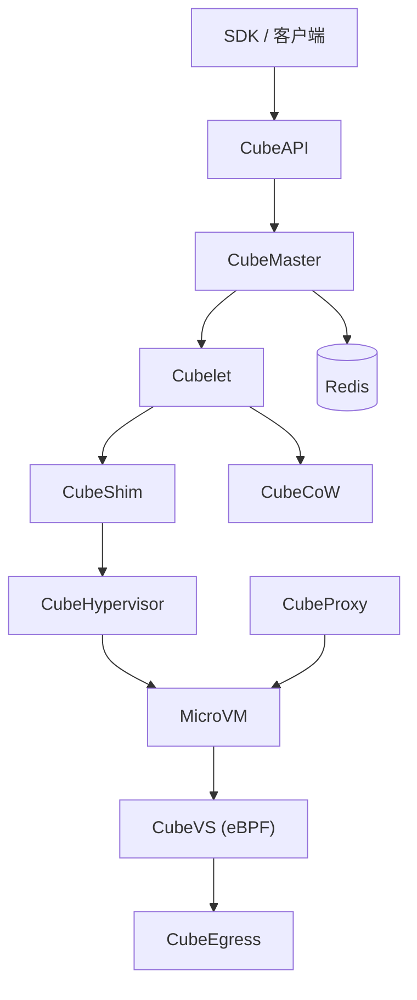

# CubeSandbox 学习文档（概括版）

> 一页纸速览：用最少的篇幅建立对整个 CubeSandbox 项目的整体认知。完整图文版见 [`architecture-tutorial.html`](./architecture-tutorial.html) 与 [`architecture-tutorial.md`](./architecture-tutorial.md)。

## 一句话定位

CubeSandbox 是基于 **RustVMM + KVM** 的高性能安全沙箱服务：把"微虚拟机（MicroVM）"在 **<60ms** 内启动，每个沙箱跑**独立内核**，为 AI Agent 提供硬件级隔离、可并发上千实例的执行环境，且 **SDK 兼容 E2B**（只换一个 URL 即可迁移）。

## 核心数字

| 指标 | 数值 |
|---|---|
| 冷启动 | <60ms（单并发 60ms，50 并发 P95 90ms） |
| 内存开销 | <5MB / 实例 |
| 隔离级别 | 独立内核 + eBPF（极高） |
| 部署密度 | 单节点上千沙箱 |
| 兼容性 | E2B SDK 直接替换 |

## 架构一张图



**两条主线**：控制面（CubeAPI / CubeMaster / WebUI / Redis，**无状态**，Redis 是唯一真相源）与数据面（Cubelet / CubeShim / Hypervisor / CubeCoW / CubeVS / CubeEgress，每节点本地运行）。

## 组件速查表

| 组件 | 语言 | 角色 |
|---|---|---|
| CubeAPI | Rust | E2B 兼容 REST 网关，转 gRPC |
| CubeMaster | Go | 集群调度，选节点、发事件到 Redis |
| CubeProxy | Lua | 反向代理与路由（Host / Path 模式） |
| Cubelet | Go | 节点本地沙箱全生命周期管理 |
| CubeShim | Rust | containerd Shim v2，桥接 MicroVM |
| CubeHypervisor | RustVMM | KVM 微虚拟机管理（vCPU/内存/virtio） |
| CubeVS | eBPF | 内核态网络：SNAT/DNAT、连接跟踪、策略 |
| CubeCoW | Rust | XFS reflink 存储，O(1) 快照/克隆 |
| CubeEgress | Lua | L7 出网代理：域名过滤、凭据注入、审计 |

## 四个关键流程

**1. 创建沙箱（请求生命周期）** — `SDK → CubeAPI → CubeMaster(选节点) → Cubelet(克隆rootfs) → CubeShim → Hypervisor(恢复VM) → 写回Redis事件`。

**2. 沙箱状态机** — `running ⇄ paused`（auto-pause/resume）与 `running → terminated`（kill 不可逆）。驱动参数：`timeout`（空闲秒数）、`on_timeout`（`pause` / `kill`）。

**3. 存储（CubeCoW）** — 模板经 `FICLONE` 克隆出沙箱 rootfs/内存卷（零拷贝）；快照只持久化脏页，未变页经 reflink 共享。

**4. 网络 + 安全** — 三个 eBPF 程序（`from_cube` / `from_world` / `from_envoy`）在内核态做 SNAT/反向 NAT；出网默认拒绝私有网段，HTTP(S) 经 CubeEgress L7 代理做域名白名单与密钥注入（密钥不进沙箱）。

## 上手三行

```python
from cubesandbox import Sandbox
sandbox = Sandbox.create(template="<id>", timeout=60)   # 60s 空闲后回收
sandbox.run_code("print('hello')")
```

安装后访问 `http://<控制节点IP>:12088` 用 Web 控制台管理。环境要求：`x86_64 Linux` + `KVM`。
