# CubeSandbox 架构教学文档

> 一份面向开发者的可视化教学文档，用流程图拆解 CubeSandbox 的整体架构、请求生命周期、沙箱状态机、存储快照、网络安全与出网管控。适合刚接触本项目、希望快速建立心智模型的同学。
>
> 配套的可视化网页版见 [`architecture-tutorial.html`](./architecture-tutorial.html)。本文中的流程图均使用 Mermaid 语法，在支持 Mermaid 的 Markdown 渲染器中可直接显示。

## 1. 这是什么

CubeSandbox 是一个面向 AI Agent 的高性能、开箱即用的安全沙箱服务。它在 KVM 之上把"微虚拟机（MicroVM）"启动到几十毫秒级别，每个沙箱都运行自己独立的 Linux 内核，因此没有 Docker 那种"共享内核逃逸"的风险，可以安全地执行不可信的、由大模型生成的代码。

六个设计原则贯穿整个系统：Agent 优先（SDK 形态与生命周期围绕 Agent 工作负载设计）、硬件隔离（独立 KVM 内核）、毫秒级启动（预快照模板 + RustVMM 恢复路径）、零信任出网（所有出站流量经 L7 代理）、无状态控制面（Redis 唯一真相源）、高效存储（CubeCoW 基于 `FICLONE` 做 O(1) 快照）。

| 指标 | Docker 容器 | 传统 VM | CubeSandbox |
|---|---|---|---|
| 隔离级别 | 低（共享内核） | 高（独立内核） | 极高（独立内核 + eBPF） |
| 启动速度 | ~200ms | 数秒 | 亚毫秒（<60ms） |
| 内存开销 | 低 | 高 | 极低（<5MB） |
| 部署密度 | 高 | 低 | 极高（单节点上千） |
| E2B 兼容 | — | — | ✅ 直接替换 |

## 2. 整体架构

一条外部请求从客户端 SDK 出发，依次经过 CubeAPI（REST）→ CubeMaster（gRPC 调度）→ Cubelet（节点代理）→ CubeShim（containerd 桥接）→ CubeHypervisor（RustVMM 管理 KVM）→ 最终落到 MicroVM。控制面通过 Redis 共享元数据与事件，数据面在网络和出网处由 CubeVS（eBPF NAT）和 CubeEgress（L7 透明代理）把关。

通信协议的选择：外部 SDK 用 REST（E2B 兼容），内部组件间用 gRPC + protobuf——跨语言（Rust / Go）强类型契约、HTTP/2 多路复用、自动生成客户端/服务端存根，且与 containerd CRI 生态一致。CubeMaster → Cubelet 之间定义的 `CubeboxMgr` service 包含 Create、Destroy、List、Exec、CommitSandbox、RollbackSandbox 等十几个 RPC，消息中完整描述了容器配置、卷挂载、安全上下文（SELinux / Seccomp / Capabilities）、网络策略（EgressRule）等复杂结构——这正是 Protobuf 优于手写 JSON 的场景。

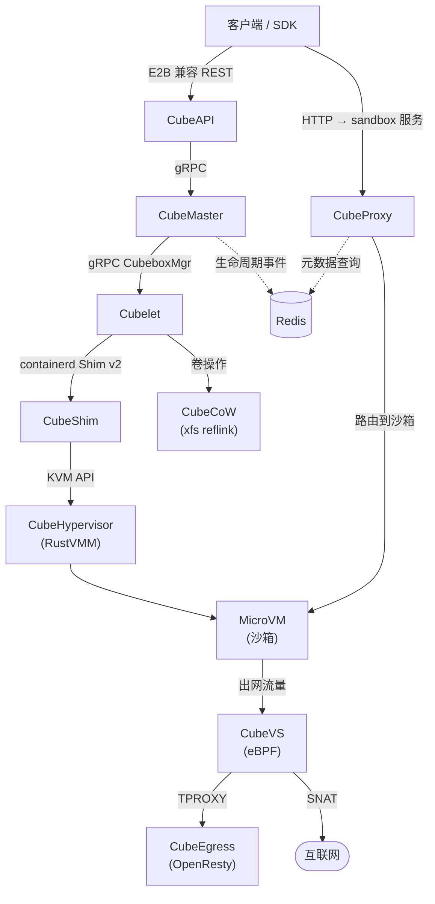

**记忆要点**：控制面（API / Master / Proxy / Redis）是"无状态"的，所有协调都走 Redis；数据面（Cubelet / Shim / Hypervisor / CoW / VS / Egress）是"节点本地"的，每个计算节点各自管理本机上的沙箱。

## 3. 控制面 / 数据面

理解 CubeSandbox 最重要的一个分法，就是把系统拆成"控制面"和"数据面"两层。

| 层 | 组件 | 职责 |
|---|---|---|
| 控制面 | CubeAPI、CubeMaster、WebUI、Redis | API 网关、调度、状态协调、运营看板 |
| 数据面 | Cubelet、CubeShim、CubeHypervisor、CubeCoW、CubeVS、CubeEgress、CubeProxy | VM 生命周期、存储、网络、安全执行与请求路由 |

关键推论：因为控制面无状态，任意 CubeAPI 或 CubeMaster 实例都可以服务任意请求——负载均衡器后面挂多个副本即可水平扩展。数据面则无共享状态，每个节点的 Cubelet 管理自己的沙箱，节点发生故障只会影响该节点上的沙箱。

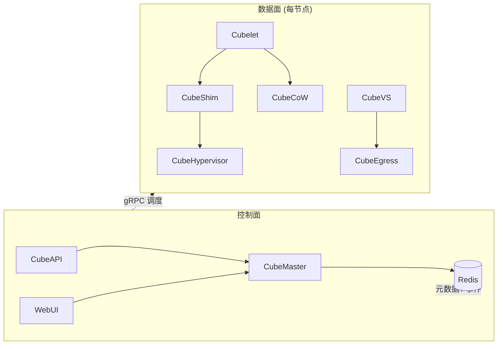

## 4. 核心组件

每个组件各司其职：

- **CubeAPI**（Rust / Axum）：E2B 兼容的 REST API 网关，把 SDK 调用翻译成内部 gRPC，处理鉴权回调并转发给 CubeMaster。
- **CubeMaster**（Go）：集群级编排调度器，按资源情况选节点、派发任务给 Cubelet，并向 Redis 发布生命周期事件。
- **CubeProxy**（OpenResty / Lua）：反向代理与请求路由，支持 Host 与 Path 两种模式，从 Redis 读取沙箱元数据做路由。
- **Cubelet**（Go）：节点本地调度代理，管理本机所有沙箱的完整生命周期与 CubeCoW 卷操作。
- **CubeShim**（Rust）：实现 containerd Shim v2，桥接容器运行时与真实 MicroVM，负责资源准备、VM 启动/恢复、vsock 通信。
- **CubeHypervisor**（RustVMM + KVM）：轻量 VMM，管理 vCPU、内存、virtio 设备、启动/暂停/快照/恢复，seccomp 加固。
- **CubeVS**（eBPF / C+Go）：内核态网络数据面，SNAT/DNAT、有状态连接跟踪、LPM 路由策略、ARP 代理。
- **CubeCoW**（Rust）：基于 XFS reflink 的瘦供给存储引擎，O(1) 快照与克隆，零拷贝。
- **CubeEgress**（OpenResty / Lua）：主机本地 L7 出网代理，做域名过滤、凭据注入、访问审计。

另外还有几个辅助组件：**cube-lifecycle-manager**（Go）消费 Redis 事件流协调 auto-pause/resume；**network-agent**（Go）管理 CubeVS 的 BPF 加载与设备生命周期；**Buildkit** 将 OCI 镜像构建为模板。

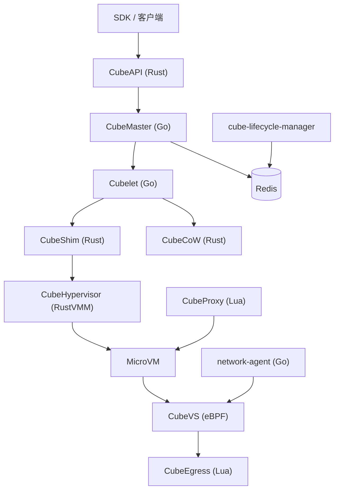

## 5. 创建沙箱：请求生命周期

当你调用 `Sandbox.create()` 时，一次创建请求在系统中这样流动：`SDK → CubeAPI → CubeMaster（选节点 + 调度）→ Cubelet（克隆 rootfs + 注册网络）→ CubeShim（containerd Create + Start）→ Hypervisor（KVM create_vm + restore_vm）→ 写回 Redis 事件`。

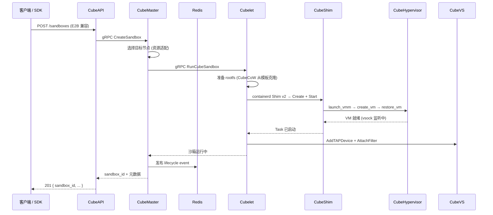

**每个步骤的幕后细节**：

- **CubeMaster 调度**：收到 gRPC 请求后，Master 查询 Redis 中所有 Cubelet 节点的资源上报信息（剩余 CPU / 内存 / 磁盘 / MvmNum），按首次适配（First-Fit）策略选出可用节点，再通过 gRPC 调用该节点的 Cubelet 的 `CubeboxMgr.Create()`。
- **CubeCoW 克隆**：Cubelet 根据模板 ID 找到该节点上缓存的模板 rootfs 和内存快照文件，通过 `FICLONE` 克隆出沙箱专用的 rootfs 卷和内存卷——这是一个 O(1) 的元数据操作，不拷贝任何字节。
- **containerd 与 Shim**：Cubelet 调用 containerd 创建 sandbox，containerd 根据配置的 runtime handler 找到 CubeShim（二进制实现 Shim v2 接口），Shim 启动一个独立的 gRPC 服务与 containerd 通信，然后调用 CubeHypervisor 的 RustVMM 启动 KVM 虚拟机。
- **Hypervisor 恢复**：CubeHypervisor 从之前保存的内存快照文件恢复 VM（restore_vm），让沙箱内的 Linux 内核从快照状态直接运行——这是亚 60ms 启动的关键。恢复后沙箱内的 agent 进程（cube-agent）通过 vsock 与 Shim 通信。
- **CubeVS 网络**：Cubelet 调用 network-agent 的 `AddTAPDevice` 为沙箱创建 TAP 设备（固定内部 IP `169.254.68.6`、网关 `169.254.68.5`），再调用 `AttachFilter` 将 `from_cube` eBPF 程序挂载到 TAP 的 TC ingress 上。

成功后，CubeMaster 将沙箱元数据（ID、IP、节点、模板等）写入 Redis，并通过 Redis 的 Stream 发布 `sandbox.created` 事件，供 cube-lifecycle-manager 和 WebUI 消费。

## 6. 沙箱生命周期与调度

### 6.1 调度策略

CubeMaster 作为集群调度器，每次创建沙箱时执行以下调度流程：查询所有可用节点的资源报表→逐节点过滤（CPU / 内存 / MvmNum / 模板缓存是否齐全）→选择第一个满足所有条件的节点（First-Fit）→通过 gRPC 下发创建。可调优参数包括 `paused_resource_release_ratio`（暂停的沙箱是否释放 CPU/内存配额给新沙箱，范围 0~1，默认 0 即保留全部配额）。节点定期向 Redis 上报资源使用情况，Master 据此决策。

### 6.2 状态机

每个沙箱在任何时刻都处于且仅处于一个状态：`running` / `pausing` / `paused` / `resuming` / `terminated`。两个关键参数驱动状态切换：

- `timeout`（可选）：空闲多少秒触发超时。省略时由服务端决定；`NEVER_TIMEOUT(-1)` 永不超时；`0` 立即回收。
- `on_timeout`：超时时 `kill`（默认，销毁）还是 `pause`（快照，便于恢复）。

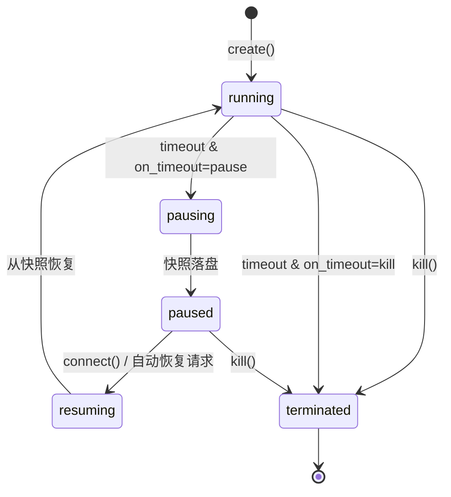

### 6.3 auto-pause / auto-resume 协调细节

cube-lifecycle-manager（一个独立的 Go 服务，运行在控制节点上）监听 Redis Stream 中的生命周期事件。当某个沙箱进入 idle 状态且 timeout 已到且 `on_timeout=pause`，它发起 pause 流程：Cubelet 通过 CubeShim 触发 Hypervisor 做内存快照（只持久化匿名脏页）；快照落盘后沙箱状态变为 `paused`，CPU 和内存完全释放。当新请求到达 CubeProxy，Proxy 发现目标沙箱处于 `paused`，通知 cube-lifecycle-manager 发起 resume。cube-lifecycle-manager 通过 Redis `SETNX` 获得分布式锁，确保同一沙箱不会被两个副本同时暂停/恢复。Resume 完成后沙箱回到 `running`，timeout 重新开始倒数。

`kill()` 是不可逆的——即使设置了 `on_timeout="pause"`，显式 `kill()` 也会丢弃快照。

## 7. 存储：CubeCoW 快照与克隆

CubeCoW 是 CubeSandbox 的存储引擎，核心是 Linux 内核的 `FICLONE` ioctl（XFS reflink），让快照和克隆变成"元数据操作"——共享物理区块，不拷贝字节。

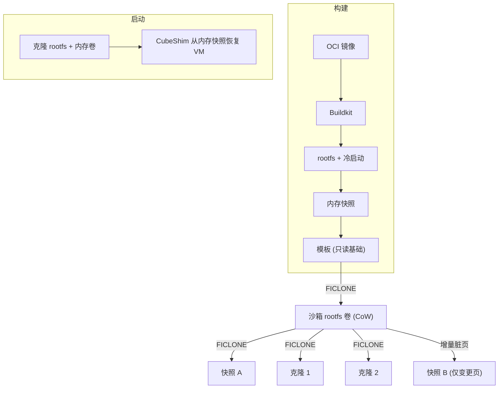

**扁平快照模型**：CubeCoW 采用扁平快照模型（flat snapshot），而非树状或链式模型。每个快照是独立的 reflink 文件，删除一个快照不会影响其他快照——它们各自通过共享 extent 指向基础模板。这与 Docker 镜像的层叠式快照不同：Docker 删除中间层时需要 merge，CubeCoW 删除任何快照都是 O(1) 操作。

**增量脏页追踪**：内存快照并非全量 dump。CubeCoW 只持久化自上次快照以来发生变更的匿名页面（dirty pages），未变更的页面通过 reflink 共享。这使得快照体积很小（多数 Agent 工作负载中只修改了少量内存页），写入放大被降到最低。

## 8. 模板系统

模板（Template）是可复用的沙箱启动快照，包含 rootfs 和内存状态。模板构建三步走：

1. **Build OCI**：从 Dockerfile 构建出 OCI 镜像，内有所需的 Python / Node.js / 工具链等。
2. **冷启动 + 内存快照**：Buildkit 在构建机上完整启动一次 VM（冷启动耗时数秒），在 VM 内将 rootfs 加载到内存后，对整个 VM 做一次内存快照——这就是模板的"启动状态"。
3. **注册与分发**：模板（rootfs + 内存快照文件）注册到控制面，各节点的 Cubelet 按需拉取缓存。后续沙箱从模板克隆时不需要再冷启动，直接从快照恢复即可亚 60ms 运行。

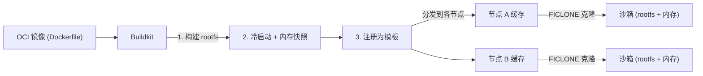

## 9. 网络：CubeVS 流量路径与关键细节

CubeVS 用 3 个 eBPF 程序在内核态完成全部网络数据面，没有 iptables、没有 Linux Bridge、没有 OVS。每个沙箱有独立 TAP 设备，内部固定地址 `169.254.68.6`，网关 `169.254.68.5`。

### 三程序架构

| 程序 | 源文件 | 挂载点 | 方向 | 职责 |
|---|---|---|---|---|
| `from_cube` | `mvmtap.bpf.c` | TAP 设备 TC ingress | 沙箱 → 主机 | SNAT、策略评估、L7 代理选择、会话创建、ARP 代理 |
| `from_world` | `nodenic.bpf.c` | 主机网卡 TC ingress | 外部 → 主机 | 反向 NAT、端口映射代理 |
| `from_envoy` | `localgw.bpf.c` | cube-dev TC egress | 代理/Overlay → 沙箱 | DNAT 到沙箱 IP、重定向到 TAP |

### 出网（沙箱 → 外部）

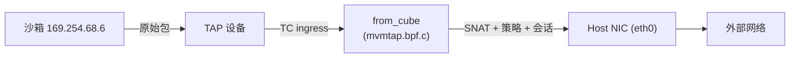

### 入网（外部 → 沙箱，会话反向 NAT）

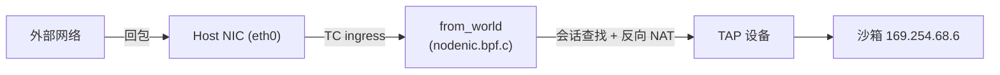

### 本地代理 / Overlay → 沙箱

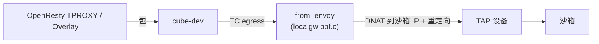

### 9 个 pinned BPF map

三个 eBPF 程序通过 9 个 pinned BPF map（固定在 `/sys/fs/bpf/`）共享状态：

| Map | 类型 | Key | Value | 用途 |
|---|---|---|---|---|
| `mvmip_to_ifindex` | Hash | 沙箱 IP | TAP ifindex | IP → 设备查找 |
| `ifindex_to_mvmmeta` | Hash | TAP ifindex | 沙箱元数据 | 设备反向查找 |
| `egress_sessions` | Hash | 沙箱侧 5 元组 | NAT 会话状态 | 出站连接追踪 |
| `ingress_sessions` | Hash | 外部侧 5 元组 | 反向查找元数据 | 回包映射到沙箱 |
| `snat_iplist` | Array | 索引 (0-3) | SNAT IP 条目 | SNAT IP 池 |
| `allow_out` | Hash-of-Maps | TAP ifindex | 内层 LPM trie | 出站白名单 CIDR |
| `deny_out` | Hash-of-Maps | TAP ifindex | 内层 LPM trie | 出站黑名单 CIDR |
| `remote_port_mapping` | Hash | 宿主机端口 | TAP ifindex + 沙箱端口 | 入站端口转发 |
| `local_port_mapping` | Hash | TAP ifindex + 沙箱端口 | 宿主机端口 | 反向端口映射优化 |

### 会话跟踪状态机

CubeVS 实现了一个有状态的 TCP 连接追踪机，包含 11 个状态，超时时间因状态而异：SYN_SENT / SYN_RECV 半开 1 分钟、ESTABLISHED 已连接 3 小时、FIN_WAIT / CLOSE_WAIT / LAST_ACK 关闭中 1-2 分钟、TIME_WAIT / CLOSE 已关闭 10 秒。UDP 用两状态模型（UNREPLIED 30 秒 / REPLIED 180 秒）。ICMP 固定 30 秒。一个 Go 后台 goroutine 每 5 秒扫描 `egress_sessions` 删除过期会话。

### ARP 代理

沙箱的网关 `169.254.68.5` 在 TAP 链路上是一个虚拟地址，没有真实设备回应 ARP。`from_cube` 检测到 ARP 请求后自动生成 ARP 回复——交换发送者和目标 IP、填入 cube-dev 的网关 MAC，回复从同一 TAP 设备发回。沙箱无需任何网络配置即可获得合法的 ARP 表项。

### 网络策略评估

策略优先级：`allow_out > deny_out > 默认允许`。此外，以下内网/私有网段始终被拒绝且不可被 allow 覆盖：`10.0.0.0/8`、`127.0.0.0/8`、`169.254.0.0/16`、`172.16.0.0/12`、`192.168.0.0/16`。

## 10. 安全：出网管控与凭据保险库

安全是分层强制的，从底层到上层共六个层次：

1. **硬件隔离**：KVM MicroVM 运行独立内核。
2. **网络隔离**：CubeVS 默认拒绝私有/链路本地网段。
3. **出网控制**：CubeEgress L7 域名白名单。
4. **凭据保险库**：密钥经 Header 注入，绝不进入沙箱、模型上下文或日志。
5. **Seccomp**：CubeHypervisor 以最小系统调用白名单运行。
6. **鉴权**：CubeAPI 支持可插拔的鉴权回调。

### 出网过滤流程

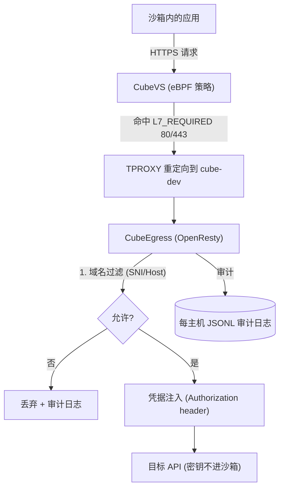

### 凭据保险库如何工作

凭据保险库是 CubeEgress 的核心功能之一。典型的场景是：Agent 需要调用 OpenAI API，但 API Key 不能进入沙箱（防止泄露到模型上下文或日志中）。集群管理员在 CubeMaster 上预先配置了一组出站规则（egress rules），包含域名匹配条件与对应的 inject 操作（header 名称 + 凭据引用）。Agent 在沙箱内像平时一样调用外部 API，请求被 CubeVS 拦截并 TPROXY 重定向到 CubeEgress。CubeEgress 按规则列表做首匹配，命中后从本地凭据存储取出 API Key 写入 `Authorization` header。请求带着完整的认证头发往目标 API，沙箱内从始至终不知道密钥的内容。所有通过/拒绝/注入操作均记录到每主机的 JSONL 审计日志中。

为了实现透明 TLS 拦截，CubeEgress 签发了一个内网根 CA，该根证书被烘焙进沙箱模板的证书信任链中——因此沙箱内的应用不需要做任何代理配置就能被透明检查。

## 11. 快速上手

环境要求：`x86_64 Linux` + `KVM`。一行 Python 即可创建并运行代码：

```python
from cubesandbox import Sandbox

# 空闲 60 秒后自动销毁（默认 on_timeout=kill）
sandbox = Sandbox.create(template="<your-template-id>", timeout=60)

# 运行代码
sandbox.run_code("print('hello from sandbox')")

# 自动暂停 / 恢复（节省资源）
sandbox = Sandbox.create(
    template="<your-template-id>",
    timeout=300,
    lifecycle={"on_timeout": "pause", "auto_resume": True},
)
```

安装后浏览器打开 `http://<控制节点IP>:12088` 即可用 Web 控制台管理沙箱、模板、节点。

## 12. 术语表

| 术语 | 含义 |
|---|---|
| MicroVM | 微虚拟机，运行独立内核的轻量虚拟机，是 CubeSandbox 的隔离单元。 |
| Shim v2 | containerd 定义的运行时接口，CubeShim 用 Rust 实现它把 MicroVM 接入容器运行时。 |
| CubeboxMgr | CubeMaster → Cubelet 之间的 gRPC service，管理沙箱的创建/销毁/执行/快照等操作。 |
| CubeCoW | 基于 XFS reflink 的存储引擎，提供 O(1) 快照与克隆。 |
| reflink / FICLONE | 内核文件克隆 ioctl，使两份文件共享物理区块、不拷贝数据。 |
| eBPF | 内核态可编程技术，CubeVS 用它做 NAT、策略、连接跟踪。 |
| TC / clsact | Linux Traffic Control 入口，eBPF 程序通过 TC 的 ingress/egress 钩子挂载到网络设备上。 |
| LPM trie | 最长前缀匹配树，CubeVS 用它做 CIDR 范围匹配的 BPF map。 |
| TPROXY | Linux 透明代理机制，CubeEgress 用它拦截出网流量做 L7 检查。 |
| Auto-pause / Auto-resume | 空闲自动暂停、下次请求透明恢复的生命周期策略。 |
| E2B 兼容 | SDK 形态与 E2B 一致，业务代码只改一个 URL 环境变量即可迁移。 |

## 参考资料

- 项目 README（整体介绍与基准数据）
- `docs/architecture/overview.md`（架构总览、请求生命周期、存储与网络分层）
- `docs/architecture/network.md`（CubeVS 三大 eBPF 程序、9 个 BPF map、会话跟踪、SNAT/DNAT、策略引擎）
- `docs/guide/lifecycle.md`（沙箱状态机、auto-pause/auto-resume、暂停资源释放）
- `docs/guide/security-proxy.md`（CubeEgress 域名过滤与凭据注入）
