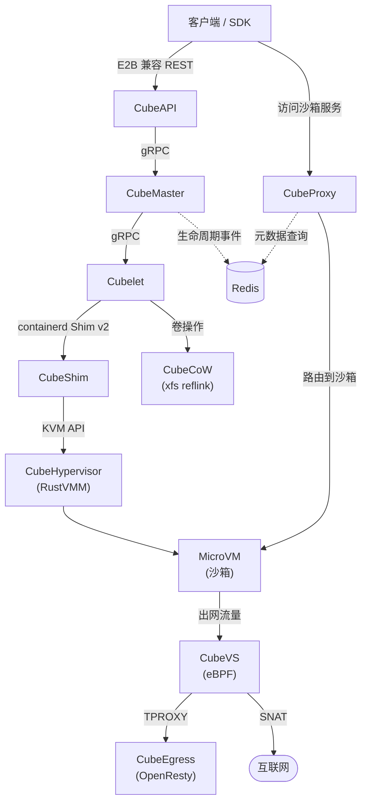
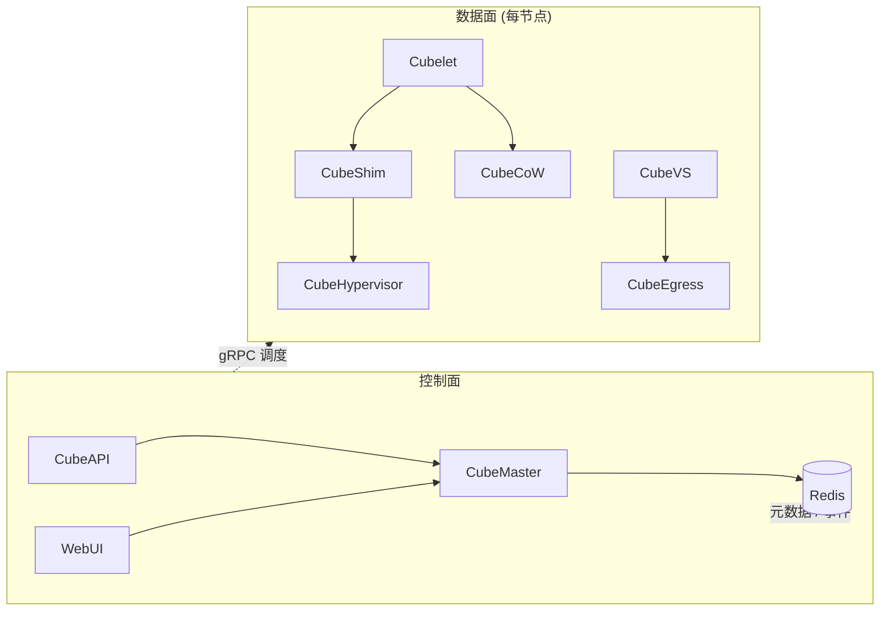
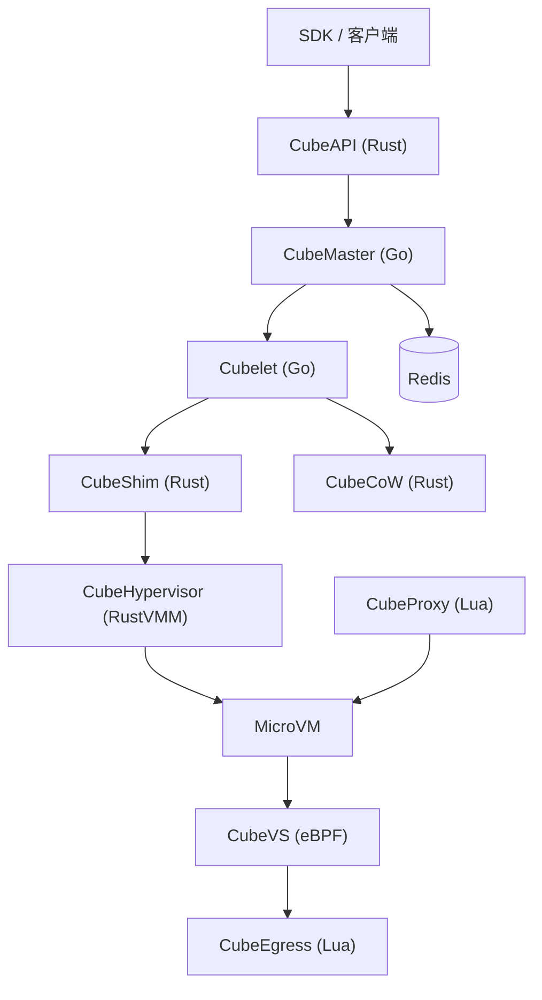
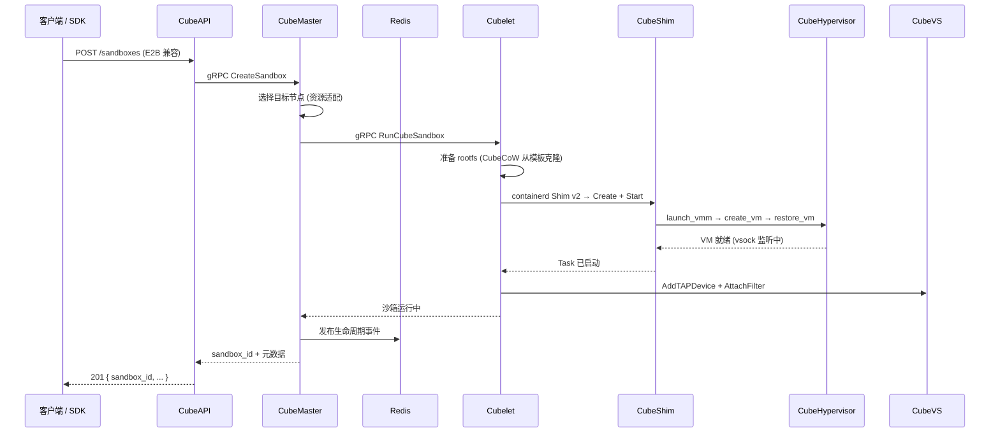
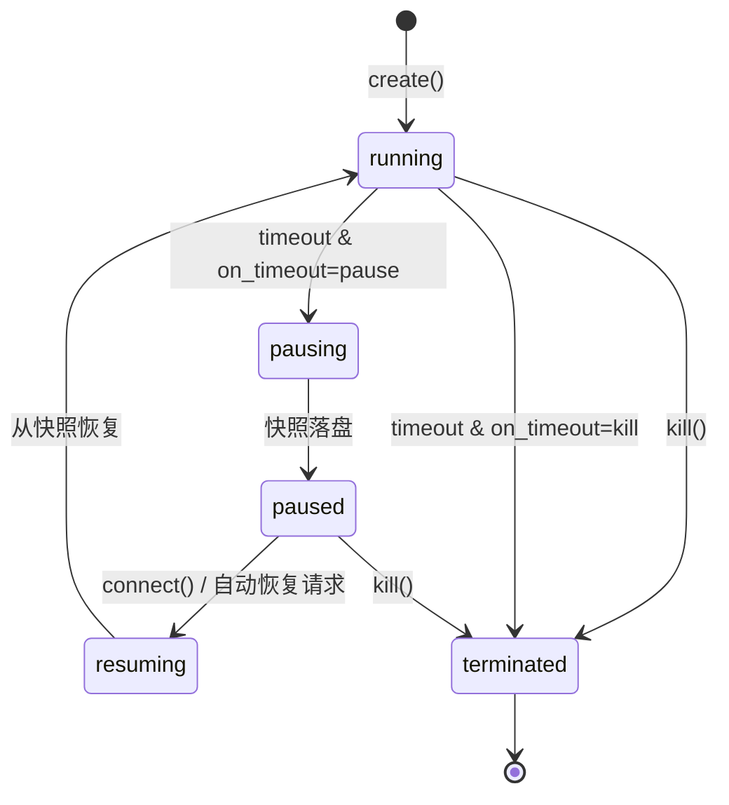
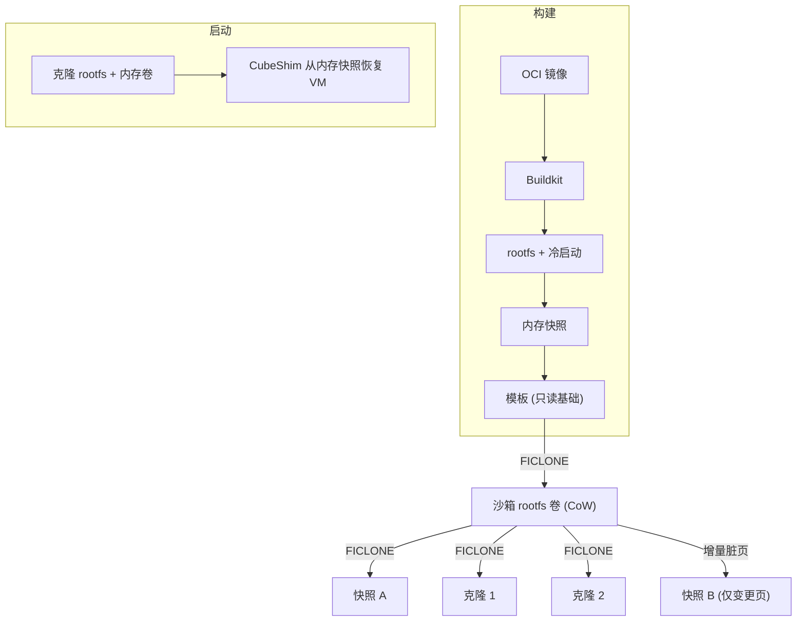
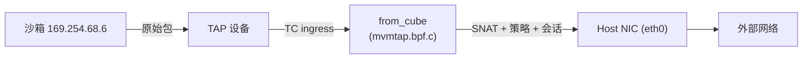
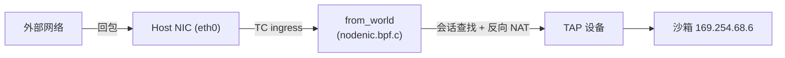
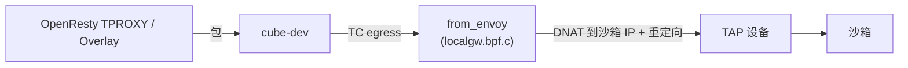
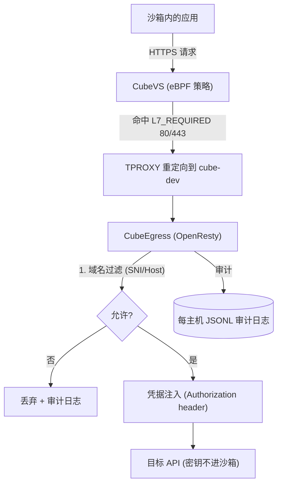

# CubeSandbox 架构教学文档

> 一份面向开发者的可视化教学文档，用流程图拆解 CubeSandbox 的整体架构、请求生命周期、沙箱状态机、存储快照、网络安全与出网管控。适合刚接触本项目、希望快速建立心智模型的同学。
>
> 配套的可视化网页版见 [`architecture-tutorial.html`](./architecture-tutorial.html)。本文中的流程图均使用 Mermaid 语法，在支持 Mermaid 的 Markdown 渲染器中可直接显示。

## 1. 这是什么

CubeSandbox 是一个面向 AI Agent 的高性能、开箱即用的安全沙箱服务。它在 KVM 之上把"微虚拟机（MicroVM）"启动到几十毫秒级别，每个沙箱都运行自己独立的 Linux 内核，因此没有 Docker 那种"共享内核逃逸"的风险，可以安全地执行不可信的、由大模型生成的代码。

几个关键数字：平均冷启动 `<60ms`，单实例内存开销 `<5MB`，单节点可跑上千个沙箱，并且与 E2B SDK 兼容——业务代码基本不用改，只换一个环境变量即可迁移。

| 指标 | Docker 容器 | 传统 VM | CubeSandbox |
|---|---|---|---|
| 隔离级别 | 低（共享内核） | 高（独立内核） | 极高（独立内核 + eBPF） |
| 启动速度 | ~200ms | 数秒 | 亚毫秒（<60ms） |
| 内存开销 | 低 | 高 | 极低（<5MB） |
| 部署密度 | 高 | 低 | 极高（单节点上千） |
| E2B 兼容 | — | — | ✅ 直接替换 |

设计原则可以概括为六点：Agent 优先、硬件隔离、毫秒级启动、零信任出网、无状态控制面、高效存储（CubeCoW 基于 `FICLONE` 做 O(1) 快照）。

## 2. 整体架构

一条外部请求从客户端 SDK 出发，依次经过 CubeAPI → CubeMaster → Cubelet → CubeShim → CubeHypervisor，最终落到 MicroVM。控制面通过 Redis 共享状态，数据面在网络和出网处分别由 CubeVS（eBPF）和 CubeEgress（L7 代理）把关。



**记忆要点**：控制面（API / Master / Proxy / Redis）是"无状态"的，所有协调都走 Redis；数据面（Cubelet / Shim / Hypervisor / CoW / VS / Egress）是"节点本地"的，每个计算节点各自管理本机上的沙箱。

## 3. 控制面 / 数据面

理解 CubeSandbox 最重要的一个分法，就是把系统拆成"控制面"和"数据面"两层。

| 层 | 组件 | 职责 |
|---|---|---|
| 控制面 | CubeAPI、CubeMaster、WebUI、Redis | API 网关、调度、状态协调、运营看板 |
| 数据面 | Cubelet、CubeShim、CubeHypervisor、CubeCoW、CubeVS、CubeEgress、CubeProxy | VM 生命周期、存储、网络、安全执行与请求路由 |



控制面无本地状态，Redis 是唯一真相源，因此任意 CubeAPI / CubeMaster 实例都能服务任意请求，水平扩展很自然。数据面节点本地运行，每个节点独立管理本机沙箱。

## 4. 核心组件

每个组件各司其职：

- **CubeAPI**（Rust / Axum）：E2B 兼容的 REST API 网关，把 SDK 调用翻译成内部 gRPC，处理鉴权回调并转发给 CubeMaster。
- **CubeMaster**（Go）：集群级编排调度器，按资源情况选节点、派发任务给 Cubelet，并向 Redis 发布生命周期事件。
- **CubeProxy**（OpenResty / Lua）：反向代理与请求路由，支持 Host 与 Path 两种模式，从 Redis 读取沙箱元数据做路由。
- **Cubelet**（Go）：节点本地调度代理，管理本机所有沙箱的完整生命周期与 CubeCoW 卷操作。
- **CubeShim**（Rust）：实现 containerd Shim v2，桥接容器运行时与真实 MicroVM，负责资源准备、VM 启动/恢复、vsock 通信。
- **CubeHypervisor**（RustVMM + KVM）：轻量 VMM，管理 vCPU、内存、virtio 设备、启动/暂停/快照/恢复，seccomp 加固。
- **CubeVS**（eBPF / C+Go）：内核态网络数据面，SNAT/DNAT、有状态连接跟踪、LPM 路由策略、ARP 代理。
- **CubeCoW**（Rust）：基于 XFS reflink 的瘦供给存储引擎，O(1) 快照与克隆，零拷贝。
- **CubeEgress**（OpenResty / Lua）：主机本地 L7 出网代理，做域名过滤、凭据注入、访问审计。



## 5. 创建沙箱：请求生命周期

当你调用 `Sandbox.create()` 时，一次创建请求在系统中是这样流动的：CubeAPI 收到 REST 请求后转成 gRPC 给 CubeMaster，Master 选好节点后交给 Cubelet，Cubelet 用 CubeCoW 从模板克隆出 rootfs，再通过 Shim 启动 Hypervisor 里的 MicroVM，最后把"运行中"的事件写回 Redis。



## 6. 沙箱生命周期状态机

每个沙箱在任何时刻都处于且仅处于一个状态：`running` / `pausing` / `paused` / `resuming` / `terminated`。两个关键参数驱动状态切换：

- `timeout`（可选）：空闲多少秒触发超时。省略时由服务端决定；`NEVER_TIMEOUT(-1)` 永不超时；`0` 立即回收。
- `on_timeout`：超时时 `kill`（默认，销毁）还是 `pause`（快照，便于恢复）。



**auto-pause / auto-resume**：大多数 Agent 工作负载并非一直忙碌。空闲时自动暂停（内存冻结到快照、CPU/内存零占用），下次请求到达时透明恢复（亚秒到数秒）。由 `cube-lifecycle-manager` 消费 Redis 事件流统一协调，并用 Redis `SETNX` 锁避免并发重复暂停/恢复。

> 注意：`kill()` 是不可逆的，即使设置了 `on_timeout="pause"`，显式 `kill()` 也会丢弃快照。

## 7. 存储：CubeCoW 快照与克隆

CubeCoW 是 CubeSandbox 的存储引擎，核心是 Linux 内核的 `FICLONE` ioctl（XFS reflink），让快照和克隆变成"元数据操作"——共享物理区块，不拷贝字节。这让"创建沙箱""打快照""克隆""回滚"都能在百毫秒内完成。



要点：

1. **模板构建**：OCI 镜像 → Buildkit → rootfs + 冷启动 → 内存快照 → 注册为模板。
2. **沙箱启动**：Cubelet 用 CubeCoW 克隆模板的 rootfs 与内存卷（O(1)，无数据拷贝），CubeShim 从内存快照恢复 VM。
3. **增量快照**：只持久化"脏页"（相对上一份快照变化的匿名内存页），未变页面通过 reflink 共享，写入放大与快照体积都最小。

## 8. 网络：CubeVS 流量路径

CubeVS 用 3 个 eBPF 程序在内核态完成全部网络数据面，没有 iptables、没有 Linux Bridge、没有 OVS。每个沙箱有独立 TAP 设备，内部固定地址 `169.254.68.6`，网关 `169.254.68.5`。

### 出网（沙箱 → 外部）



### 入网（外部 → 沙箱，会话反向 NAT）



### 本地代理 / Overlay → 沙箱



三个程序分工：`from_cube` 装在 TAP 上（沙箱→主机，做 SNAT/策略/ARP 代理）；`from_world` 装在主机网卡上（外部→主机，做反向 NAT/端口映射）；`from_envoy` 装在 cube-dev 上（代理→沙箱，做 DNAT）。它们通过 9 个 pinned BPF map 共享状态。

此外，CubeVS 默认拒绝沙箱访问私有/链路本地网段（`10.0.0.0/8`、`127.0.0.0/8`、`169.254.0.0/16`、`172.16.0.0/12`、`192.168.0.0/16`），这些不可被 allow 规则覆盖；策略评估优先级为 allow > deny > 默认允许。

## 9. 安全：出网管控

安全是分层强制的：硬件隔离（独立内核）→ 网络隔离（CubeVS 默认拒绝私有/链路本地网段）→ 出网控制（CubeEgress L7 域名白名单）→ 凭据保险库（密钥经 header 注入，绝不进入沙箱）→ Seccomp → 鉴权。



沙箱信任 CubeEgress 签发的一个根 CA（烘焙进模板），因此可以透明做 TLS 检查。Agent 像平常一样调用 LLM/外部 API，密钥却永不进入沙箱、模型上下文或日志。

## 10. 快速上手

环境要求：`x86_64 Linux` + `KVM`。一行 Python 即可创建并运行代码：

```python
from cubesandbox import Sandbox

# 空闲 60 秒后自动销毁（默认 on_timeout=kill）
sandbox = Sandbox.create(template="<your-template-id>", timeout=60)

# 运行代码
sandbox.run_code("print('hello from sandbox')")

# 自动暂停 / 恢复（节省资源）
sandbox = Sandbox.create(
    template="<your-template-id>",
    timeout=300,
    lifecycle={"on_timeout": "pause", "auto_resume": True},
)
```

安装后浏览器打开 `http://<控制节点IP>:12088` 即可用 Web 控制台管理沙箱、模板、节点。

## 11. 术语表

| 术语 | 含义 |
|---|---|
| MicroVM | 微虚拟机，运行独立内核的轻量虚拟机，是 CubeSandbox 的隔离单元。 |
| Shim v2 | containerd 定义的运行时接口，CubeShim 用 Rust 实现它把 MicroVM 接入容器运行时。 |
| CubeCoW | 基于 XFS reflink 的存储引擎，提供 O(1) 快照与克隆。 |
| reflink / FICLONE | 内核文件克隆 ioctl，使两份文件共享物理区块、不拷贝数据。 |
| eBPF | 内核态可编程技术，CubeVS 用它做 NAT、策略、连接跟踪。 |
| TPROXY | Linux 透明代理机制，CubeEgress 用它拦截出网流量做 L7 检查。 |
| Auto-pause / Auto-resume | 空闲自动暂停、下次请求透明恢复的生命周期策略。 |
| E2B 兼容 | SDK 形态与 E2B 一致，业务代码只改一个 URL 环境变量即可迁移。 |

## 参考资料

- 项目 README（整体介绍与基准数据）
- `docs/architecture/overview.md`（架构总览、请求生命周期、存储与网络分层）
- `docs/architecture/network.md`（CubeVS 三大 eBPF 程序、会话跟踪、SNAT/DNAT、策略引擎）
- `docs/guide/lifecycle.md`（沙箱状态机、auto-pause/auto-resume、暂停资源释放）
- `docs/guide/security-proxy.md`（CubeEgress 域名过滤与凭据注入）
