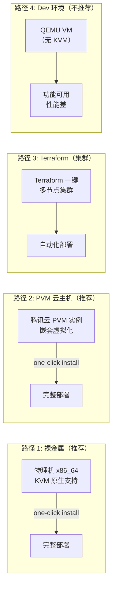

# 部署与运维指南

> CubeSandbox 的部署选项、节点管理、模板存储、WebUI 控制台、日志与监控、常见问题排查。

## 部署路径选择

CubeSandbox 支持下列部署方式，按推荐度排列：



### 各路径对比

| 路径 | KVM | 启动性能 | 并发能力 | 适用场景 |
|---|---|---|---|---|
| 裸金属 (bare-metal) | 原生 | <60ms | 极高 | 生产环境 |
| PVM 云主机 | 嵌套 | <100ms | 高 | 云上生产 |
| Terraform 集群 | 原生/嵌套 | <60/100ms | 高（多节点） | 大规模生产 |
| Dev 环境 (QEMU) | 软件模拟 | 数秒 | 极低 | 本地开发/测试 |

## 裸金属一键部署

```bash
# 前置条件: x86_64 Linux, KVM 可用
grep -E 'vmx|svm' /proc/cpuinfo   # 确认 KVM 支持

# 克隆仓库
git clone https://github.com/tencentcloud/CubeSandbox
cd CubeSandbox/deploy/one-click

# 一键安装
sudo bash install.sh
```

安装脚本完成以下步骤：

1. **依赖安装**：containerd、OpenResty、Buildkit、libbpf
2. **编译服务**：CubeAPI、CubeMaster、Cubelet、CubeShim、CubeHypervisor、CubeVS、CubeEgress、cube-lifecycle-manager、network-agent
3. **systemd 注册**：所有服务以 systemd 管理，开机自启
4. **网络初始化**：CubeVS Init() 加载 BPF 程序、pin 到 `/sys/fs/bpf/`
5. **WebUI 就绪**：`:12088` 端口开放

## 节点管理

安装完成后，通过 WebUI 或 CLI 管理节点：

```
http://<控制节点IP>:12088
```

### WebUI 控制台

| 页面 | 功能 |
|---|---|
| **Overview**（概览） | 集群节点状态、资源使用率、沙箱总数 |
| **Sandboxes**（沙箱） | 创建/列表/详情/日志/销毁/暂停/恢复 |
| **Templates**（模板） | 模板商店安装、自定义模板构建、分发状态 |
| **Nodes**（节点） | 节点列表、资源使用、标签管理 |
| **Version Matrix**（版本矩阵） | 模板与 guest-image/kernel/agent 版本兼容性检查 |

### 服务管理

所有服务通过 systemd 管理：

```bash
# 查看状态
systemctl status cube-sandbox-cubemaster
systemctl status cube-sandbox-cubelet
systemctl status cube-sandbox-cubeapi
systemctl status cube-sandbox-cubeproxy
systemctl status cube-sandbox-cubeegress
systemctl status cube-sandbox-lifecycle-manager

# 查看日志
journalctl -u cube-sandbox-cubemaster -f
journalctl -u cube-sandbox-cubelet --since "10 min ago"

# 重启服务
systemctl restart cube-sandbox-cubelet
```

### 节点标签

```bash
# cubecli 给节点打标签
cubecli node label <node-id> pool=gpu
cubecli node label <node-id> region=us-east

# CubeMaster 调度时可按标签筛选节点
```

## 模板管理

### 安装官方模板

在 WebUI 的 Template Store 中一键安装官方预设：

- `python-code-interpreter`：Python 3.12 + pip + 常用包
- `node-code-interpreter`：Node.js 22 + npm
- `browser-sandbox`：Chromium + Playwright
- `data-science`：Python + numpy/pandas/jupyter

### 自定义模板

```dockerfile
# Dockerfile 模板
FROM cubesandbox/python:3.12
RUN pip install requests openai numpy
RUN echo "custom setup" > /root/setup.sh
```

```bash
# 构建并注册为模板
cubecli template build --dockerfile ./Dockerfile --name my-template
```

## 日志和监控

### 关键日志位置

| 组件 | 日志位置 |
|---|---|
| CubeMaster | `journalctl -u cube-sandbox-cubemaster` |
| Cubelet | `journalctl -u cube-sandbox-cubelet` |
| CubeEgress 审计 | `/var/log/cubeegress/audit.jsonl` （每节点） |
| cube-lifecycle-manager | `docker logs cube-lifecycle-manager` 或 journalctl |
| Redis | `redis-cli MONITOR` |

### CubeProxy 健康检查

```bash
# 每个 CubeProxy 实例暴露健康检查端点
curl http://<node-ip>:8082/admin/healthz
# {"status":"ok","heartbeat_last_pushed_ms":1234}
```

`heartbeat_last_pushed_ms` 是 Proxy 上次向 lifecycle-manager 注册自己以来的时间。如果这个值远大于注册间隔（通常 5s），可能 Proxy 与 Manager 之间的连通性有问题。

### lifecycle-manager 日志关键字

搜索以下关键字判断 auto-pause/resume 是否正常：

```
"create event applied"     → 沙箱创建事件被处理
"auto-paused sandbox"      → 沙箱被自动暂停
"auto-resumed sandbox"     → 沙箱被自动恢复
"timeout-killed sandbox"   → 沙箱因超时被销毁（on_timeout=kill）
"failed to acquire lock"   → 无法获取分布式锁（正常，另一副本在处理）
"pause rpc failed"         → pause RPC 失败（需排查）
```

## 扩容与缩容

### 添加新节点

```bash
# 在新机器上
git clone https://github.com/tencentcloud/CubeSandbox
cd CubeSandbox/deploy/one-click
sudo bash install.sh --join <控制节点IP>
```

新节点自动注册到控制面的 Redis，Master 的调度器会在下次创建请求时发现新节点。

### 下线节点

```bash
# 驱逐节点上的所有沙箱
cubecli node drain <node-id>
# 节点上不再创建新沙箱，现有沙箱正常结束后停止 Cubelet
systemctl stop cube-sandbox-cubelet
```

## 配置调优

### CubeMaster `conf.yaml`

```yaml
cubelet_conf:
  default_timeout_insec: -1     # 无集群级 idle TTL（沙箱除非传了 timeout 否则永不回收）
  create_timeout_insec: 30      # 创建沙箱的 RPC deadline（30 秒）
scheduler_conf:
  max_retries: 3                # 调度失败重试次数
```

### Cubelet `config.toml`

```toml
[host.quota]
paused_resource_release_ratio = 0.5  # 释放一半暂停沙箱的配额

[storage]
cubecow_root = "/var/lib/cubecow"    # CubeCoW 卷存储路径
template_cache_dir = "/var/lib/cubesandbox/templates"  # 模板缓存
```

## 常见问题排查

### 问题 1：沙箱创建失败

```bash
# 检查节点资源
cubecli node list   # 看 CPU/内存/MvmNum 是否充足

# 检查 Cubelet 日志
journalctl -u cube-sandbox-cubelet --since "5 min ago" | grep -i error

# 检查模板是否在节点上
cubecli template list --node <node-id>
```

### 问题 2：沙箱无法访问外部网络

```bash
# 检查 CubeEgress 是否正常运行
systemctl status cube-sandbox-cubeegress

# 检查出站规则
# 确认 allow_internet_access=true 或配置了具体的 egress rules

# 检查 CubeVS BPF 加载
ls /sys/fs/bpf/    # 应看到 9 个 map
```

### 问题 3：auto-pause 不工作

```bash
# 检查 lifecycle-manager
docker logs cube-lifecycle-manager | tail -50

# 检查 lifecycle 参数
# on_timeout 是否是 "pause" 而非 "kill"
# auto_resume 是否设置

# 检查 Redis 连接
redis-cli PING
```

### 问题 4：快照恢复失败

```bash
# 检查磁盘空间
df -h /var/lib/cubecow

# 检查 CubeCoW volume 是否存在
cubecli storage inspect --node <node-id>
```

## 总结

CubeSandbox 的运维模型用 systemd 管理服务进程、Redis 作为共享状态、WebUI 作为可视化界面。裸金属提供最佳性能，PVM 适合云上部署，Terraform 适合大规模集群。节点管理通过 cubecli 或 WebUI 操作，扩容只需在新节点执行安装脚本。
