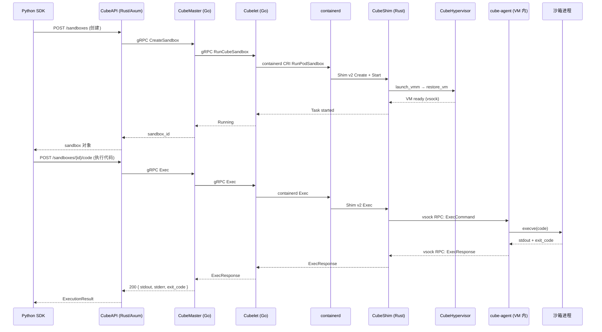
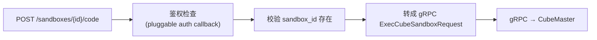
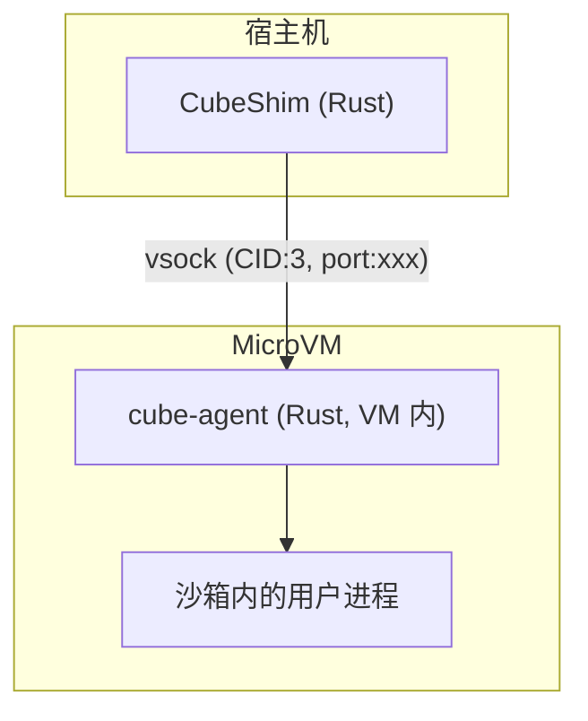
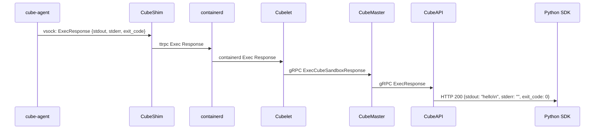

# 代码执行全流程解析

> 从 `sandbox.run_code("print('hello')")` 到沙箱内实际执行、返回 stdout/stderr 的完整链路追踪。涵盖 SDK、REST API、gRPC、containerd Shim、vsock、cube-agent 之间的交互。

## 先看整体链路



## 第一步：沙箱创建

代码执行前，沙箱必须已创建（`Sandbox.create()`）。这个流程已经在前面的架构文档中详细描述。执行代码时 SDK 持有的 `sandbox` 对象包含 `sandbox_id`、`access_token`，后续通过 REST API 与 CubeAPI 通信。

## 第二步：SDK 发起代码执行

```python
from cubesandbox import Sandbox

sandbox = Sandbox.create(template="<id>", timeout=300)
result = sandbox.run_code("print('hello')")
print(result.stdout)  # "hello\n"
```

Python SDK（`sdk/python/`）的 `run_code()` 方法做了三件事：

1. 构造请求体：`{"code": "print('hello')", "language": "python"}`（或自动检测）
2. 调用 HTTP POST `/sandboxes/{sandbox_id}/code`（E2B 兼容端点）
3. 解析返回的 `{stdout, stderr, exit_code, ...}`

## 第三步：CubeAPI 处理 REST 请求



CubeAPI（Rust / Axum）收到来自 SDK 的 REST 调用后：

1. **鉴权**：通过可插拔的回调函数验证 `access_token`。默认模式接受所有请求，生产环境可对接用户管理。
2. **路由**：从 URL 中解析 `sandbox_id`，查询 Redis 确认沙箱存在且处于 `running` 状态。
3. **gRPC 转发**：将请求转成 `ExecCubeSandboxRequest` protobuf 消息——包含 `requestID`、`sandbox_id`、`container_id`、要执行的命令/参数/环境变量/工作目录——通过 gRPC 发给 CubeMaster。

## 第四步：CubeMaster 调度到 Cubelet

CubeMaster 收到 `Exec` 请求后：

1. 查询 Redis 得到沙箱所在的节点（node_id）
2. 通过 gRPC 调用该节点的 Cubelet 的 `CubeboxMgr.Exec()`

```protobuf
// CubeMaster/api/services/cubebox/v1/cubebox.proto
service CubeboxMgr {
  rpc Exec(ExecCubeSandboxRequest) returns (ExecCubeSandboxResponse);
}

message ExecCubeSandboxRequest {
  string requestID = 1;
  string sandbox_id = 2;
  string container_id = 3;
  bool terminal = 7;
  repeated string args = 9;
  repeated string env = 10;
  string cwd = 11;
}
```

## 第五步：Cubelet 通过 containerd 调用 Shim

Cubelet 收到 gRPC Exec 后，调用本地 containerd 的 CRI 接口：

```
Cubelet.Exec()
  → containerd.Task.Exec(ctx, containerID, spec)
    → CubeShim.Exec(ctx, request)     // 通过 Shim v2 gRPC
```

containerd 作为容器运行时管理层，负责镜像拉取、存储、命名空间管理。CubeShim 是在 containerd 中注册为 "io.containerd.cube.v1" 的运行时——当 containerd 发现 sandbox 用这个 runtime handler 创建时，所有后续操作（Create、Start、Exec、Kill、Pause、Resume）都会调用 CubeShim 的对应方法。

CubeShim 通过 ttrpc（轻量版的 gRPC，containerd 和 Shim 之间的标准通信协议，不走 TCP 而是走 Unix socket）与 containerd 通信。

## 第六步：CubeShim → cube-agent（vsock RPC）



CubeShim 通过 **vsock**（虚拟机 socket）与沙箱内的 cube-agent 通信。vsock 使用 `VMADDR_CID_HOST` 和 `VMADDR_CID_ANY` 寻址，相比 virtio-serial 的优势是支持多路复用、不需要在客户机内配置串口设备。

cube-agent 是一个在沙箱模板构建时预装的 Rust 进程，监听 vsock 端口。它提供一系列 RPC 接口（定义在 `agent/libs/protocols/protos/agent.proto`）：

```protobuf
service Agent {
  rpc CreateSandbox(CreateSandboxRequest) returns (Empty);
  rpc Exec(ExecRequest) returns (ExecResponse);
  rpc Signal(SignalRequest) returns (Empty);
  rpc Wait(WaitRequest) returns (WaitResponse);
  // ... HealthCheck, GetMetrics, Freeze, Restore, etc.
}
```

## 第七步：cube-agent 执行代码

cube-agent 收到 `Exec` 请求后：

1. **fork + exec**：在沙箱内 fork 子进程，通过 `execve()` 执行指定命令。对于 Python 代码执行，实际执行的命令是 `python3 -c "print('hello')"`。

2. **stdout/stderr 捕获**：通过管道捕获子进程的标准输出和标准错误。

3. **等待退出**：`waitpid()` 获取子进程退出码（exit_code）。

4. **返回结果**：将 `stdout`、`stderr`、`exit_code` 打包成 `ExecResponse` 通过 vsock 回传给 Shim。

5. **超时处理**：如果执行时间超过 client 指定的 timeout，cube-agent 发送 `SIGKILL` 给子进程。

## 第八步：结果返回链路

回传路径：`cube-agent → vsock → CubeShim → ttrpc → containerd → Cubelet → gRPC → CubeMaster → gRPC → CubeAPI → REST → SDK`



SDK 收到响应后，将其封装成 `ExecutionResult` 对象返回给用户。用户可以直接访问 `result.stdout`、`result.stderr`、`result.exit_code`。

## 完整数据格式

**REST 请求** (E2B 兼容):
```json
POST /sandboxes/<sandbox_id>/code
{
  "code": "print('hello')",
  "language": "python",
  "env_vars": {"KEY": "value"},
  "timeout": 30000
}
```

**REST 响应** (E2B 兼容):
```json
{
  "stdout": "hello\n",
  "stderr": "",
  "exit_code": 0,
  "error": null
}
```

## Shell 命令执行

除了 `run_code()`，SDK 还支持 `commands.run()` 直接在沙箱中执行任意 Shell 命令：

```python
result = sandbox.commands.run("ls -la /home")
print(result.stdout)
```

底层流程与代码执行完全一致，只是传入 `ExecRequest` 的 `args` 字段是 Shell 命令参数（如 `["sh", "-c", "ls -la /home"]`）而不是 `["python3", "-c", "print('hello')"]`。

cube-agent 在执行 Shell 命令时：
- 通过 `PATH` 环境变量查找可执行文件
- 支持标准 Shell 重定向和管道
- 设置了 cgroup 限制（CPU/内存），继承自沙箱创建时的 spec

## 文件读写

SDK 也提供了 `sandbox.files.read()` / `sandbox.files.write()`，底层走的是 **E2B 的文件 API**（一套独立于代码执行的 REST 端点）：

```
POST /sandboxes/{sandbox_id}/files/read   → CubeAPI → gRPC → Cubelet → agent RPC → 读文件
POST /sandboxes/{sandbox_id}/files/write  → CubeAPI → gRPC → Cubelet → agent RPC → 写文件
```

文件操作走 cube-agent 的 `ReadFile` / `WriteFile` gRPC（vsock 内），不经过 containerd exec 路径。

## 错误处理

- 沙箱不存在：CubeAPI 返回 404
- 沙箱已终止：返回 410 Gone
- 执行超时：返回 exit_code = -1，error 字段含超时描述
- cube-agent 崩溃：Shim 检测 vsock 断开，返回 503
- cube-lifecycle-manager 协调中：沙箱处于 pausing/resuming 时请求被拒绝（409）

## 性能要点

- 代码执行的开销主要来自 gRPC 链路的序列化/反序列化——首次调用约为 5-10ms（含 protobuf 序列化 + 网络往返）
- vsock 通信比 virtio-serial 快约 40%，且支持多路复用
- cube-agent 的 fork+exec 开销与普通 Linux 进程相同（<1ms）
- containerd → Shim 的 ttrpc 走 Unix socket，接近零开销
- 整体端到端延迟（不含沙箱内代码执行时间）：30-80ms

## 总结

一条 `sandbox.run_code()` 调用经过的完整路径：Python SDK → HTTP REST → CubeAPI(Rust) → gRPC → CubeMaster(Go) → gRPC → Cubelet(Go) → containerd → ttrpc → CubeShim(Rust) → vsock → cube-agent(Rust, VM内) → fork/exec → 用户代码执行。回传按相同路径反向。每一步都是编译期类型安全的通信协议（protobuf/ttrpc），无 JSON 字符串解析开销。
