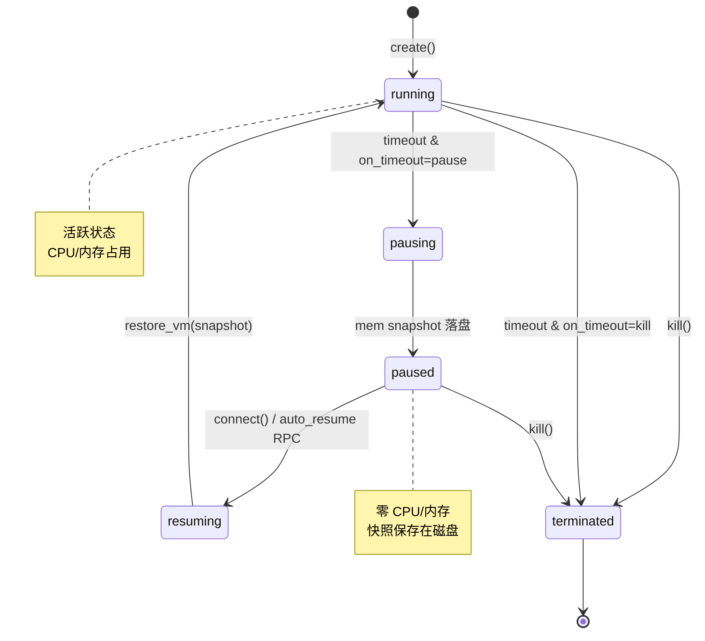
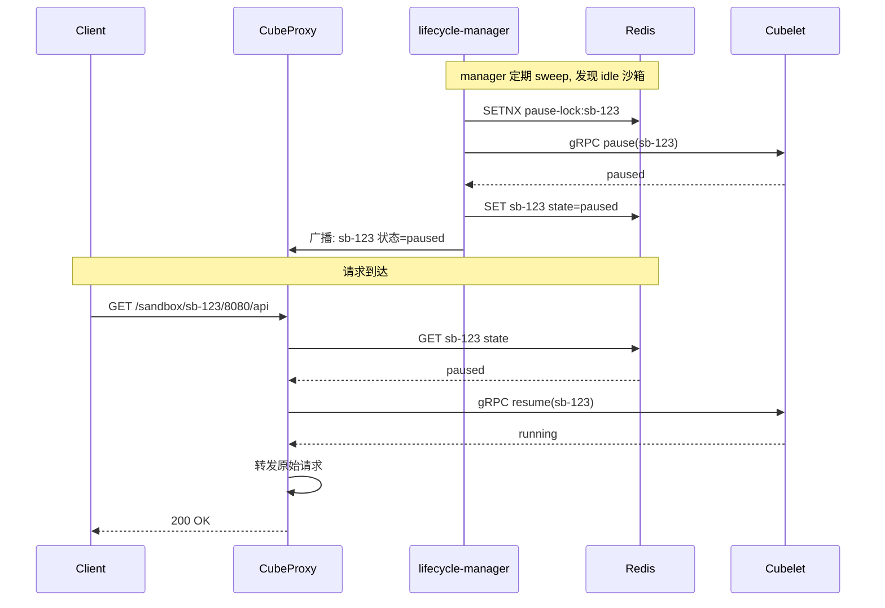

# 沙箱生命周期与自动管理深度解析

> 深入 CubeSandbox 的沙箱生命周期管理：完整状态机、auto-pause/auto-resume 协调机制、cube-lifecycle-manager 内部实现、Redis SETNX 分布式锁、timeout 策略、资源配额释放。

## 完整状态机



## 驱动参数

两个参数控制状态切换：

| 参数 | 取值 | 语义 |
|---|---|---|
| `timeout` (seconds) | 省略 | 服务端默认值（可配为 -1 = 永不超时） |
| | `NEVER_TIMEOUT` / `-1` | 永不因空闲被回收 |
| | `0` | 首次 idle sweep 即回收 |
| | 正整数 N | 空闲 N 秒后触发 |
| `on_timeout` | `"kill"` (默认) | 超时后销毁，不可恢复 |
| | `"pause"` | 超时后快照暂停，可恢复 |

## timeout 的非平凡行为

```
create(timeout=300, lifecycle={on_timeout:"pause", auto_resume:true})

t=0s   create() → running.  idle 时钟开始倒数。
t=120s SDK 调用 run_code() → idle 时钟重置为 300s。
t=350s 无活动 300s → auto-pause 触发。
       pausing → (快照) → paused. CPU/内存释放。
t=500s 新 HTTP 请求到达 CubeProxy → auto-resume RPC。
       resuming → (恢复快照) → running. 时钟重置为 300s。
t=850s 又 idle 300s → 再次 auto-pause。
```

**每次 auto-resume 成功后，timeout 从头开始倒数**（对齐 E2B 语义）。这也是"resume → 短暂使用 → idle out → pause"循环可以无限重复的原因。

## 什么算"活动"

以下任何操作都会重置 idle 时钟：

- SDK 调用：`sandbox.run_code()`, `sandbox.commands.run()`, `sandbox.files.read/write()`
- 直接 HTTP 请求到沙箱服务端口（通过 `getHost()` 获取的 URL）
- `sandbox.pause()` / `sandbox.connect()` 显式调用

## cube-lifecycle-manager 工作原理

`cube-lifecycle-manager` 是一个独立的 Go 服务，运行在控制节点上（`cube-lifecycle-manager/` 目录）。它负责把"沙箱应该被暂停"的决策转化为实际的 pause RPC。

```mermaid
flowchart TB
    Master["CubeMaster"] -->|"lifecycle event"| RedisStream["Redis Stream"]
    RedisStream -->|"消费"| Mgr["cube-lifecycle-manager"]
    Mgr --> Sweep["每 N 秒扫描<br/>所有 running 沙箱"]
    Sweep --> Check{"now - last_activity<br/>> timeout?"}
    Check -->|"否"| Skip["跳过"]
    Check -->|"是"| Lock{""SETNX<br/>pause-lock:sandboxID<br/>获得锁?"}
    Lock -->|"否"| Skip2["跳过<br/>(已被其他副本处理)"]
    Lock -->|"是"| Pause["gRPC → Cubelet.pause(sandboxID)"]
    Pause --> Release{"暂停成功?"}
    Release -->|"是"| SetState["更新 Redis: state=paused"]
    Release -->|"否"| Unlock["释放锁"]
    SetState --> Unlock

    Proxy["CubeProxy"] -->|"请求到达<br/>发现 state=paused"| Resume["gRPC → Cubelet.resume(sandboxID)"]
    Resume --> Forward["转发原始请求"]
```

### 关键设计

1. **Redis Stream 事件驱动**：CubeMaster 在每次状态变更时发布事件到 Redis Stream，manager 消费后维护本地的沙箱状态缓存。这样避免了每次 sweep 都全量查询。

2. **Redis SETNX 分布式锁**：多个 manager 副本（用于高可用）通过 `SETNX pause-lock:{sandboxID} {instanceID} EX 30` 竞争锁。只有一个副本能获得锁并执行实际的 pause RPC。锁 30s 过期，防止持有者崩溃导致死锁。

3. **CubeProxy 注册表**：每个 CubeProxy 实例定期向 Redis 注册自己（`HEARTBEAT proxy:{id}`），manager 通过这个表发现所有存活的 Proxy 并广播 resume 状态——这样 Proxy 在收到对 paused 沙箱的请求时知道该唤醒它。

4. **按需 resume**：resume 不由 manager 主动发起，而是由 CubeProxy 在收到请求时触发——避免了不必要的唤醒。

## paused_resource_release_ratio

默认行为：即使沙箱已 paused（零 CPU/内存），调度器仍然把它算作"占用"的资源配额。这保证了 **resume 永远成功**（不需要为它保留资源），但降低了节点可创建新沙箱的能力。

Cube 提供了节点级的调优参数 `paused_resource_release_ratio`：

| 参数值 | 行为 | 适用场景 |
|---|---|---|
| `0.0` (默认) | Paused 沙箱保留全部配额 | 可用性优先：resume 永不因资源不足失败 |
| `1.0` | Paused 沙箱 CPU/内存配额完全释放 | 密度优先：最大化并发沙箱数，resume 可能失败 |
| `0 < r < 1` | 释放 r，保留 (1-r) 作为 headroom | 平衡模式：保留一部分保证 resume 成功率 |

```toml
# Cubelet/config/config.toml
[host.quota]
paused_resource_release_ratio = 0.5
```

当 `ratio > 0` 时，每次 resume 触发 **本地实时准入检查**——如果节点空闲容量不足以容纳释放的部分，resume 被拒绝，返回 HTTP 409。这是一个可重试的状态码：当其他沙箱销毁或暂停后释放容量，resume 可重试。

**重要**：磁盘和 MvmNum 不受 ratio 影响——暂停快照仍占用存储，沙箱对象本身仍存在。

## CubeProxy 与 lifecycle-manager 的协作



## 故障模式

| 故障 | 行为 | 恢复 |
|---|---|---|
| resume RPC 失败 | CubeProxy 返回 503 + Retry-After | 客户端自动重试 |
| 沙箱已被 kill | 返回 410 Gone | 客户端停止重试 |
| manager 崩溃 | sweep 停止，paused sandbox 保持 paused（无泄漏） | 新 manager 副本接管 |
| pause 中途失败 | 释放 SETNX 锁，沙箱保持 running | 下次 sweep 重试 |
| Redis 不可用 | 无法获取锁/更新状态，全系统降级 | 等待 Redis 恢复 |

## 推荐配置

```python
# 场景 1: 短暂代码执行（默认 kill 策略）
# 适合：一次性任务，执行完即销毁
sandbox = Sandbox.create(template="...", timeout=60)
sandbox.run_code("...")
# → 60s idle 后自动销毁

# 场景 2: 长期运行的 Agent（auto-pause 策略）
# 适合：多轮对话 Agent，idle 时暂停节省成本
sandbox = Sandbox.create(
    template="...",
    timeout=300,
    lifecycle={"on_timeout": "pause", "auto_resume": True},
)

# 场景 3: 永不超时（手动管理）
# 适合：开发调试、需要精确控制生命周期的场景
from cubesandbox import NEVER_TIMEOUT
sandbox = Sandbox.create(template="...", timeout=NEVER_TIMEOUT)
# → 仅在显式 kill() 时销毁
```

## 总结

CubeSandbox 的生命周期管理把"弹性伸缩"逻辑从应用层移到了基础设施层。Agent 代码不需要自己管理暂停/恢复——它只管正常调用 SDK，基础设施在有请求时自动唤醒沙箱、空闲时自动冻结。cube-lifecycle-manager + Redis Stream + SETNX 锁的组合保证了多副本环境下的正确性，paused_resource_release_ratio 允许运维在可用性和密度之间做调节。
