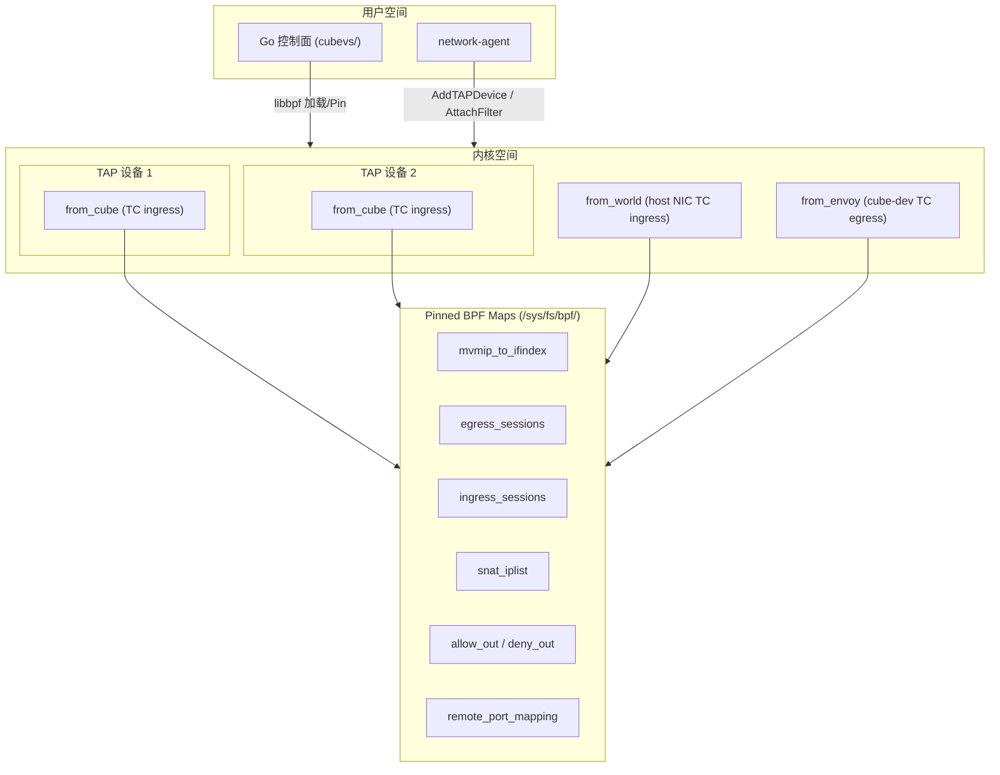
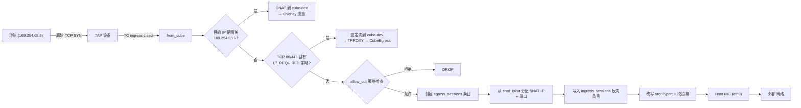
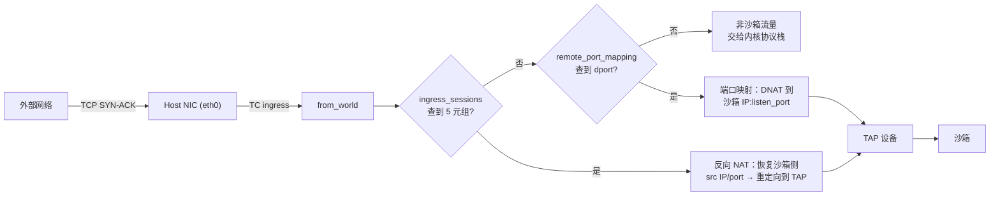
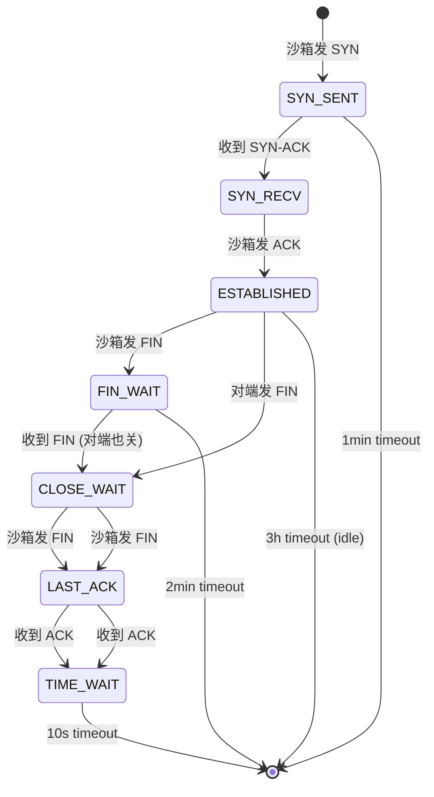
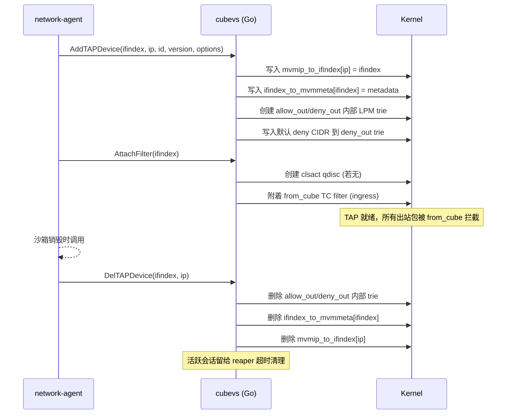

# CubeVS 网络深度解析

> 深入 CubeSandbox 的网络数据面：三个 eBPF 程序的完整路径、9 个 BPF map 的协作模式、TCP 11 状态会话跟踪、SNAT/DNAT 端口分配、ARP 代理与网络策略引擎。

## 为什么不用 iptables / OVS / Linux Bridge

传统容器网络栈有结构性问题：iptables 规则数随租户数量爆炸（每个租户 O(n) 条规则）；OVS/Linux Bridge 有软件交换跳转开销；NAT conntrack 表膨胀时插入性能下降。

CubeVS 的应对：用 3 个小而专注的 eBPF 程序替代整个栈，每个程序附着在内核数据路径的关键边界点。**没有规则爆炸**（策略用 LPM trie，O(log n) 查找），**没有软件交换机**（每个沙箱有独立 TAP 设备，点对点通信），**没有顺序扫描**（所有 Map 都是 O(1) HashMap）。

## 三程序架构



| 程序 | 源文件 | 挂载点 | 方向 | 职责 |
|---|---|---|---|---|
| `from_cube` | `mvmtap.bpf.c` | TAP 设备 TC ingress | 沙箱 → 主机 | SNAT、策略评估、L7 代理选择、会话创建、ARP 代理 |
| `from_world` | `nodenic.bpf.c` | 主机网卡 (eth0) TC ingress | 外部 → 主机 | 反向 NAT、端口映射代理 |
| `from_envoy` | `localgw.bpf.c` | cube-dev TC egress | 代理/Overlay → 沙箱 | DNAT 到沙箱 IP、重定向到 TAP |

每个沙箱创建一个 TAP 设备，`from_cube` 通过 `clsact` qdisc 附着在该 TAP 的 ingress 钩子上。`from_world` 和 `from_envoy` 只在 `Init()` 时加载一次，全局共享。

## 9 个 BPF Map 详解

三个 eBPF 程序通过 9 个 pinned BPF map（固定在 `/sys/fs/bpf/` 文件系统下）共享状态。Pin 意味着程序在不同时间加载（例如每个 TAP 加载自己的 `from_cube` 时，可以和之前 `Init()` 加载的 `from_world` 共享同一套 Map）。

| Map | 类型 | Key | Value | 读方 | 写方 |
|---|---|---|---|---|---|
| `mvmip_to_ifindex` | Hash | 沙箱 IP (u32) | TAP ifindex (u32) | from_envoy | network-agent |
| `ifindex_to_mvmmeta` | Hash | TAP ifindex (u32) | 沙箱元数据 (struct) | from_cube, from_world | network-agent |
| `egress_sessions` | Hash | 沙箱侧 5 元组 | NAT 会话状态 | from_world, reaper | from_cube |
| `ingress_sessions` | Hash | 外部侧 5 元组 | 沙箱坐标 (IP+port+version) | from_world | from_cube |
| `snat_iplist` | Array | 索引 (0-3) | SNAT IP + ifindex + 端口水位线 | from_cube | Go SetSNATIPs() |
| `allow_out` | Hash-of-Maps | TAP ifindex (u32) | 内层 LPM trie (CIDR) | from_cube | Go AttachFilter() |
| `deny_out` | Hash-of-Maps | TAP ifindex (u32) | 内层 LPM trie (CIDR) | from_cube | Go AttachFilter() |
| `remote_port_mapping` | Hash | 宿主机端口 (u16) | TAP ifindex + 沙箱端口 | from_world | Go AddPortMapping() |
| `local_port_mapping` | Hash | TAP ifindex + 沙箱端口 | 宿主机端口 (u16) | from_cube | Go AddPortMapping() |

**设计要点**：
- 双 Map 会话模型（egress + ingress）使 O(1) 双向查找成为可能——from_world 不用扫描 egress_sessions 全表。
- Hash-of-Maps（allow_out / deny_out）使每个沙箱的策略独立——更新沙箱 A 的策略不会触及沙箱 B 的内部 LPM trie。
- Map 都 pin 在 `/sys/fs/bpf/` 下，重启 Cubelet 不丢状态（只要不手动 `rm`）。

## 出网路径：沙箱 → 外部网络



**步骤细节**：

1. **网关识别**：`from_cube` 检查 `daddr == 169.254.68.5`。这是内部 overlay 流量的标记——重定向到 cube-dev。
2. **L7 代理选路**：对于 TCP 80/443，如果沙箱有 L7_REQUIRED 出站策略，`from_cube` 把原始包（不 NAT）重定向到 `cube-dev` 的 ingress。宿主机上的 TPROXY iptables 规则匹配 `iif cube-dev + dport 80/443`，把包交给 CubeEgress（OpenResty）。不需要 fwmark。
3. **策略检查**：用 LPM trie 在 `allow_out` / `deny_out` 中查找 `daddr`。优先级 allow > deny > 默认允许。私有网段（`10.0.0.0/8`、`127.0.0.0/8`、`169.254.0.0/16`、`172.16.0.0/12`、`192.168.0.0/16`）在 `AddTAPDevice` 时被写入 deny_out，不可被 allow 覆盖。
4. **SNAT**：SNAT IP 选择按 `jhash(sandbox_ip) % 4` 确定——同一沙箱的出站连接使用同一个 SNAT IP，简化外部防火墙规则和日志。端口从该 IP 的水位线单调递增分配（起始 30000，到 65535 回绕），用 BPF spin lock 保护并发分配。插入 `ingress_sessions` 时用 `BPF_NOEXIST` 做冲突检测——如果该 SNAT IP:port 已被同一个外部端点使用，递增端口重试（最多 10 次）。

## 入网路径：外部 → 沙箱（回包）



`from_world` 处理两类入站流量：
- **会话反向 NAT**（回包路径）：用回包的 5 元组在 `ingress_sessions` 中查找，得到沙箱侧坐标（sandbox_ip, sandbox_port, version）。恢复原始 dst IP/port，重定向到正确的 TAP 设备。
- **端口映射**（服务暴露）：如果在 `ingress_sessions` 中没找到，检查 `remote_port_mapping[dport]`。若匹配，这是静态端口转发——DNAT 到沙箱 IP:listen_port，重定向到 TAP。端口映射路径不创建会话条目（节省 Map 空间）。

## 会话跟踪状态机

CubeVS 实现了完整的 TCP 连接追踪状态机，仿 Linux 内核 `nf_conntrack`。



| 协议 | 状态 | 超时 | 说明 |
|---|---|---|---|
| TCP | SYN_SENT, SYN_RECV | 1 分钟 | 半开连接，快速回收 |
| TCP | ESTABLISHED | 3 小时 | 长连接容忍 |
| TCP | FIN_WAIT, CLOSE_WAIT, LAST_ACK | 1-2 分钟 | 关闭握手等待 |
| TCP | TIME_WAIT, CLOSE | 10 秒 | 短暂保留，吸收重传 |
| UDP | UNREPLIED | 30 秒 | 首包出去，等回包 |
| UDP | REPLIED | 180 秒 | 双向通信，延长超时 |
| ICMP | Any | 30 秒 | echo_id 当 "端口" |

**Session Reaper**：Go 后台 goroutine 每 5 秒扫描 `egress_sessions`（通过 `bpf_map_get_next_key` 遍历），对每个条目比较 `now - access_time > state_timeout`。过期时同时删除 `egress_sessions` 和 `ingress_sessions` 条目。非正常终止态（如 ESTABLISHED 未收 FIN 即超时）记 warning 日志。占用率超 80% 告警。

## SNAT 端口分配细节

端口从每个 SNAT IP 的水位线单调递增：

```
snat_iplist[0].next_port = 30000
      │
      ▼ allocate
snat_iplist[0].next_port = 30001
      │
      ▼ allocate ... 到 65535 回绕到 30000
```

碰撞避免：分配端口后，用 `BPF_NOEXIST` 标志尝试插入 `ingress_sessions`。如果 key 已存在（同一 SNAT IP:port + 同一外部 endpoint），递增端口重试，最多 10 次。10 次全冲突则丢弃该包。

SNAT IP 选择：`index = jhash(sandbox_ip) % 4`，同一沙箱始终用同一个 SNAT IP。

## ARP 代理

沙箱网关 `169.254.68.5` 在 TAP 的点对点链路中没有真实设备。`from_cube` 作为内核态的 ARP 代理：

1. 沙箱发 ARP Request："Who has 169.254.68.5? Tell 169.254.68.6"
2. `from_cube` 检测到 ARP 包（`ether_type == ARP`，`arp_op == REQUEST`，`target_ip == gateway`）
3. 构造 ARP Reply：交换 sender/target IP、填充 cube-dev 网关 MAC 为 sender MAC
4. 将 Reply 从同一 TAP 设备往 egress 方向发回

沙箱完全不知道自己在一个虚拟网上——它在内核里拿到了合理的 ARP 缓存，后续直接用 IP 发包。

## DNAT 路径

`from_envoy`（cube-dev TC egress）处理两种 DNAT：

1. **Overlay/代理流量**：dst IP 从 overlay-facing 地址改写为 `169.254.68.6`，通过 `mvmip_to_ifindex` 查找目标 TAP，重定向。
2. **网关注入**：如果 src IP 是 cube-gateway（`cubegw0_ip`），SNAT src 为 `169.254.68.5`（沙箱看到的标准网关地址）。
3. **IP_TRANSPARENT 代理回包**：保留原始 remote source IP（沙箱看到真实客户端 IP），不做 src 改写。CubeEgress 的 OpenResty 在 TPROXY 模式下用 `IP_TRANSPARENT` socket 选项发送回包，`from_envoy` 识别后跳过 src SNAT。

## 网络策略引擎

策略评估流程（在 `from_cube` 中，每个出站包都执行）：

```
1. daddr == 169.254.68.5 (网关)?
   → YES: 允许 (内部 Overlay 流量)

2. sandbox 有 allow_out map 且 daddr 命中?
   → YES: 允许

3. sandbox 有 deny_out map 且 daddr 命中?
   → YES: 丢弃

4. 默认: 允许
```

优先顺序：allow > deny > 默认允许。因此可以设 `deny_out: [0.0.0.0/0]` 阻止所有出站，再用 allow_out 开特定 CIDR 孔。

**始终拒绝的 CIDR**（`AddTAPDevice` 时写入 deny_out，不可被 allow 覆盖）：
`10.0.0.0/8`、`127.0.0.0/8`、`169.254.0.0/16`、`172.16.0.0/12`、`192.168.0.0/16`

## TAP 设备生命周期



## 初始化：Init() 流程

`Init()` 在 network-agent 启动时调用一次，完成系统级设置：

1. **加载 BPF 对象**：从 ELF 文件（localgw.o, mvmtap.o, nodenic.o）加载三个程序。
2. **常量重写**：在字节码中用实际值替换编译时常量——沙箱 IP `169.254.68.6`、网关 IP `169.254.68.5`、沙箱 MAC、cube-dev ifindex/IP/MAC、Host NIC ifindex/IP/MAC + 下一跳网关 MAC。让 BPF 程序在保留编译期优化（如展开分支）的同时有运行时灵活性。
3. **Pin 程序和 Map**：所有程序和 Map 以持久路径 pin 在 `/sys/fs/bpf/` 下。
4. **附着 TC filter**：`from_envoy` 附着 cube-dev TC egress；`from_world` 附着 host NIC TC ingress + loopback TC ingress。

`from_cube` 不在 Init() 时附着——每个 TAP 创建时单独调用 `AttachFilter()`。

## 端口分区

宿主机可用端口被划分为三个不重叠的区间：

| 端口范围 | 用途 | 分配者 |
|---|---|---|
| 10000-19999 | `ip_local_port_range`（宿主机临时端口） | network-agent 启动时设置 |
| 20000-29999 | CubeProxy → 沙箱的端口 | network-agent 创建沙箱时分配 |
| 30000-65535 | 沙箱出站 SNAT 源端口 | CubeVS 的 from_cube 分配 |

## 总结

CubeVS 用 3 个 eBPF 程序 + 9 个 BPF Map 在内核态完成了传统网络栈需要 iptables + conntrack + bridge + OVS 才能做到的事。核心设计取舍：双 Map 会话模型（O(1) 双向查找）、LPM trie 策略引擎（O(log n) CIDR 匹配）、水位线 SNAT 端口分配（无锁高并发）、ARP 代理（无共享广播域）。所有数据面代码在内核态执行——策略、NAT、会话跟踪——无用户态上下文切换。
