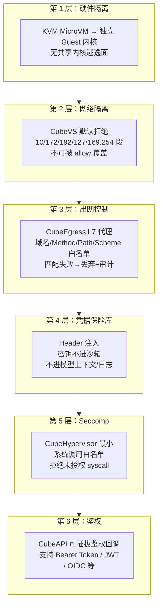
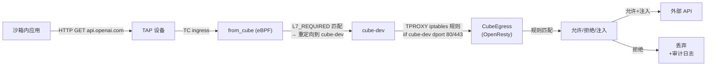
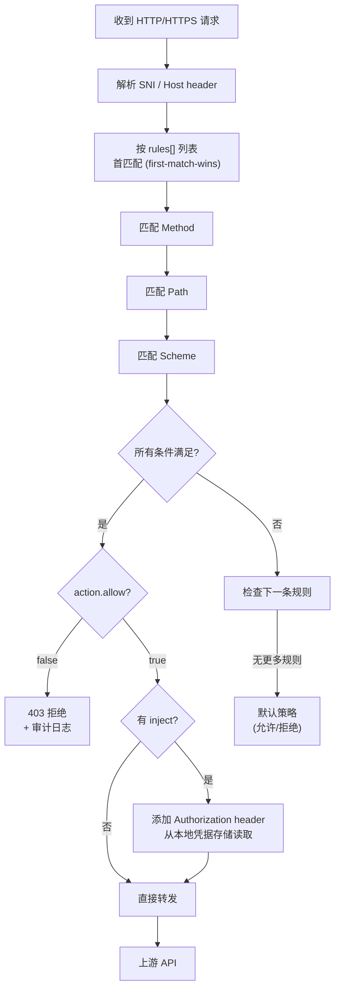
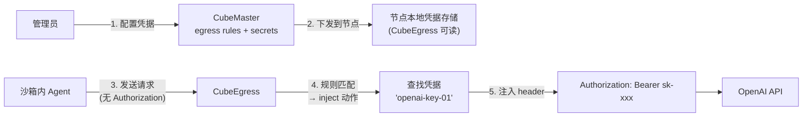

# CubeEgress 安全深度解析

> 深入 CubeSandbox 的安全数据面：L7 出站代理、域名过滤、凭据保险库、TLS 透明拦截、审计日志、Seccomp 加固与六层安全架构的完整协作。

## 六层安全架构



六层从外到内逐级收紧：硬件隔离确保不可逃逸，网络策略阻断内网侧向移动，L7 代理控制出站目标，凭据保险库保护密钥，Seccomp 限制内核攻击面，鉴权控制入口。任一层失守，后层仍能兜底。

## CubeEgress 架构

CubeEgress 是每个计算节点上的 **L7 透明代理**，基于 OpenResty（nginx + LuaJIT）。它工作在"中间人"位置——所有沙箱的出站 HTTP/HTTPS 流量被强制经过它。



### 流量如何被拦截

1. **eBPF 识别**：`from_cube` 检查出站包。如果 `dport == 80 || dport == 443` 且沙箱网络配置中有 L7_REQUIRED 规则，**不执行 SNAT**——把原始包重定向到 `cube-dev` 接口的 ingress。
2. **TPROXY 接收**：宿主机上的 iptables TPROXY 规则匹配 `iif cube-dev + dport 80/443`，把包交给 OpenResty 的透明代理 listen socket。不需要 fwmark。
3. **透明代理处理**：OpenResty 用 `$remote_addr` 变量还原原始目标地址（内核 TPROXY 保留了原始 dst 信息），向后端发起请求。

### CubeEgress 内部处理

OpenResty 在每个请求上执行 Lua 脚本（`CubeEgress/` 目录下的 `.lua` 文件）：



## 出站规则 (EgressRule) 配置

```protobuf
// CubeMaster/api/services/cubebox/v1/cubebox.proto
message CubeNetworkConfig {
  optional bool allow_internet_access = 1;
  repeated string allow_out = 2;
  repeated string deny_out = 3;
  repeated EgressRule rules = 4;
}

message EgressRule {
  string name = 1;
  optional EgressRuleMatch match = 2;
  optional EgressRuleAction action = 3;
}

message EgressRuleMatch {
  optional string sni = 1;       // TLS SNI 匹配
  optional string host = 3;      // HTTP Host header 匹配
  repeated string method = 4;    // GET/POST/PUT...
  optional string path = 5;      // URL path 前缀匹配
  optional string scheme = 7;    // http/https
}

message EgressRuleAction {
  bool allow = 1;
  optional string audit = 2;     // "log" / "deny" / "off"
  repeated EgressRuleInject inject = 3;
}

message EgressRuleInject {
  string header = 1;             // "Authorization"
  string secret = 2;             // 凭据引用名
  optional string format = 3;    // "Bearer {secret}"
}
```

**配置示例**（允许 Agent 调用 OpenAI，注入 API Key）：

```yaml
rules:
  - name: "allow-openai"
    match:
      sni: "api.openai.com"
      method: ["GET", "POST"]
      path: "/v1/"
      scheme: "https"
    action:
      allow: true
      audit: "log"
      inject:
        - header: "Authorization"
          secret: "openai-key-01"
          format: "Bearer {secret}"
  - name: "deny-all-other"
    match:
      host: "*"
    action:
      allow: false
      audit: "deny"
```

## 凭据保险库

凭据保险库是 CubeEgress 的核心安全特性。**凭据从不进入沙箱**——Agent 代码像平常一样调用外部 API，API Key 由 CubeEgress 在请求离开宿主机前注入。

### 凭据生命周期



### 为什么不能进沙箱

三个场景说明凭据为何必须隔离：

1. **模型上下文泄露**：Agent 的 system prompt 里可能包含沙箱执行结果，如果密钥在 stdout 里出现，它可能进入 LLM 的上下文窗口——而 LLM 提供商可能记录这些上下文。
2. **日志泄露**：沙箱内的代码执行日志可能被导出或分析，密钥出现在日志中是常见的安全事故。
3. **恶意代码**：不可信的第三方代码可能主动读取环境变量并回传密钥。

### 凭据存储格式

节点本地的凭据存储是一个简单的 key-value 文件（`/usr/local/services/cubetoolbox/CubeEgress/secrets.json`）：

```json
{
  "openai-key-01": "sk-proj-xxxxxxxxxxxx",
  "anthropic-key-01": "sk-ant-xxxxxxxxxxxx",
  "github-token-01": "ghp_xxxxxxxxxxxx"
}
```

CubeEgress 启动时加载，按需引用。生产环境可对接 Vault 或 KMS 做加密存储。

## TLS 透明拦截

CubeEgress 对 HTTPS 流量做透明 MITM（中间人检查），这是实现 L7 域名过滤和凭据注入的前提：

1. **内网 CA**：CubeEgress 持有一个自签名的根 CA 证书和私钥。
2. **证书烘焙**：这个根 CA 的公钥在模板构建时被安装到沙箱的 `/etc/ssl/certs/` 中。
3. **动态签发**：当沙箱发起 `https://api.openai.com` 连接时，CubeEgress 作为透明代理拦截 TLS Client Hello，解析 SNI，用内网 CA 实时签发一张 `api.openai.com` 的临时证书返回给沙箱。
4. **沙箱侧**：沙箱内的 TLS 库信任内网 CA → 接受 CubeEgress 签发的证书 → 完成 TLS 握手 → 认为自己在和真正的 api.openai.com 通信。
5. **Egress 侧**：CubeEgress 以正常客户端身份与真正的 api.openai.com 完成 TLS 握手。

### 安全考量

- 内网 CA 私钥仅存在于 CubeEgress 节点上，不进入沙箱。
- 沙箱只能验证 CubeEgress 签发的证书——不能签发证书。
- 如果沙箱尝试固定公钥（certificate pinning），TLS 握手会失败——这是一种预期的安全限制（该沙箱不能绕过检查）。

## Seccomp 加固

CubeHypervisor 以 seccomp 过滤器运行，限制可用的系统调用。配置在 `CubeShim/` 的构建中定义：

```json
{
  "defaultAction": "SCMP_ACT_ERRNO",
  "architectures": ["SCMP_ARCH_X86_64"],
  "syscalls": [
    {"names": ["read", "write", "openat", "close", "fstat", "lseek",
               "mmap", "mprotect", "munmap", "brk",
               "ioctl", "fcntl", "epoll_create1", "epoll_ctl", "epoll_wait",
               "clock_gettime", "getpid", "exit", "exit_group",
               "futex", "nanosleep", "sched_yield",
               "sigaltstack", "rt_sigaction", "rt_sigprocmask",
               "clone", "clone3", "wait4", "kill",
               "socket", "connect", "bind", "listen", "accept4",
               "setsockopt", "getsockname", "getpeername",
               "prctl", "arch_prctl", "set_robust_list", "rseq",
               "set_tid_address", "gettid", "tgkill",
               "newfstatat", "statx", "getdents64",
               "readlinkat", "getrandom"],
     "action": "SCMP_ACT_ALLOW"}
  ]
}
```

白名单之外的任何 syscall 都会导致进程被内核终止。这限制了 RustVMM 的暴露面——即使 KVM 子系统有漏洞，攻击者能执行的 syscall 也极度受限。

## 审计日志

CubeEgress 将每个决策写入每主机的 JSONL 审计日志：

```json
{"time":"2026-07-20T10:30:01Z","sandbox_id":"sb-abc123","sni":"api.openai.com","method":"POST","path":"/v1/chat/completions","rule":"allow-openai","action":"allow","inject":["Authorization"],"latency_ms": 234}
{"time":"2026-07-20T10:30:15Z","sandbox_id":"sb-def456","sni":"evil.com","method":"GET","path":"/steal","rule":"deny-all-other","action":"deny","reason":"no matching allow rule"}
```

日志包含：时间戳、沙箱 ID、目标 SNI/Host/Method/Path、匹配的规则名、动作（allow/deny/inject）、注入的 header 列表（不包含密钥值）、代理延迟。

生产环境可将 JSONL 流导向集中式日志系统（Elasticsearch / Loki）做聚合查询和告警。

## CubeEgress 部署

每个计算节点运行一个 CubeEgress 实例（作为 systemd 服务 `cube-sandbox-cubeegress`）：

- 监听 TPROXY 透明代理端口（由 iptables 规则重定向）
- 加载节点本地的凭据文件和出站规则（由 CubeMaster 下发）
- OpenResty 的 worker 进程数等于 CPU 核数
- 支持热重载规则（`nginx -s reload`）不中断代理

## 安全总结

| 层 | 机制 | 防什么 |
|---|---|---|
| 硬件 | KVM + 独立内核 | 容器逃逸、共享内核漏洞 |
| 网络 | CubeVS 拒绝私有网段 | 内网横向移动 |
| L7 代理 | CubeEgress 域名白名单 | 未授权的出站连接 |
| 凭据 | Header 注入（不进沙箱） | 密钥进入 LLM 上下文/日志 |
| 内核 | Seccomp 最小 syscall | RustVMM 内核攻击面 |
| 鉴权 | 可插拔 auth callback | 未授权的沙箱创建/操作 |
| 审计 | JSONL 日志全量记录 | 不可追溯的操作 |
