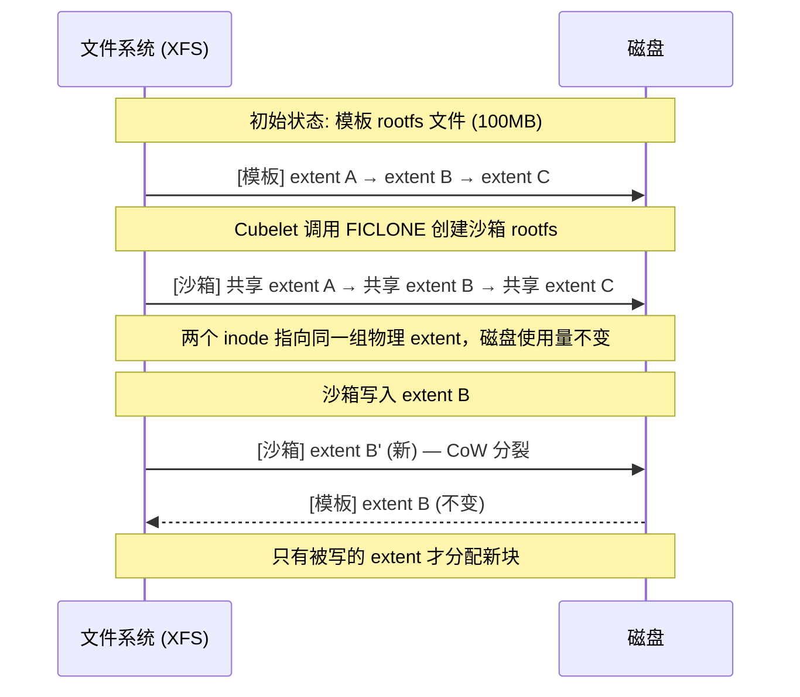
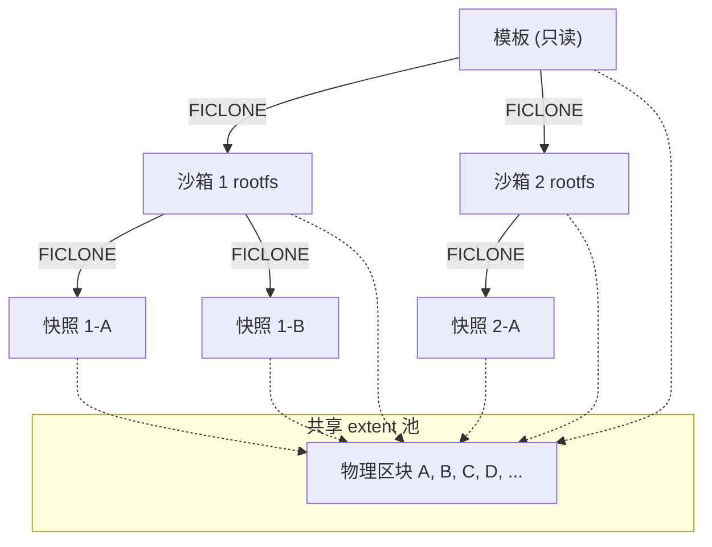
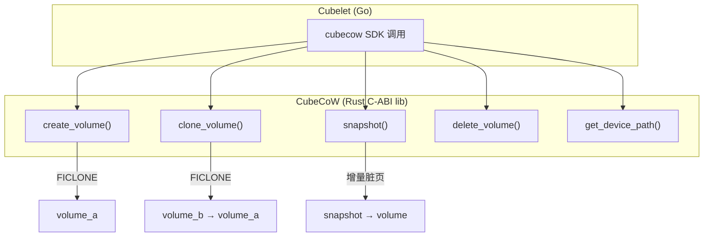
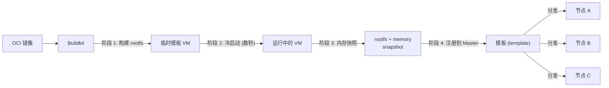

# CubeCoW 存储与快照机制

> 深入 CubeSandbox 的存储引擎：XFS reflink 的 O(1) 快照与克隆、扁平快照模型、增量脏页追踪、模板构建与分发、以及 Cubelet 中卷管理的完整流程。

## 为什么不用 Docker 的层叠式快照

Docker 的 overlay2 存储驱动用层叠模型（layer stacking）：每个容器有多个只读层（来自镜像的每一层）加一个可写层。快照（commit）需要"压平"所有层——这是一次全量数据拷贝。尤其在 AI Agent 场景中，每个 sandbox 都可能需要打快照、做回滚，100ms 级别的拷贝是不可以接受的。

CubeCoW 的应对：基于 XFS 的 **reflink**（`FICLONE` ioctl），快照和克隆都是纯元数据操作——两个文件共享同一组物理区块（extents），只有真正写入时才触发 copy-on-write 分裂。

## FICLONE 原理



`FICLONE` 是 XFS 特有的 ioctl，利用文件系统的反向映射（rmap）和引用计数（refcount）树，让两个 inode 共享同一组 extent。当任一文件写入时，XFS 自动触发 CoW——将受影响的 extent 拷贝后分配给写入方，未被写的 extent 仍然共享。

因此：
- **克隆 100MB 文件**：0 字节拷贝，<1ms 完成（两次 inode 操作）
- **克隆 100 个沙箱**：每个沙箱得到自己的 rootfs inode，但所有未被修改的 extent 共享同一份物理数据
- **磁盘开销**：只有真正被写入的 extent 才占用额外空间

## 扁平快照模型



CubeCoW 采用**扁平（flat）快照模型**，而非 Docker 的树状/链式模型。关键特性：

| 特性 | Docker overlay2（链式） | CubeCoW（扁平） |
|---|---|---|
| 快照依赖 | 快照链上的中间层不可删除 | 每个快照独立，删除任一个不影响其他 |
| 删除中间层 | 需要 merge（拷贝所有数据） | O(1) 操作（decref + 移除 inode） |
| 克隆开销 | 创建新的 layer | reflink 元数据操作 |
| 回滚 | 切换层指针 | 直接 FICLONE 一个快照到新的 rootfs |

扁平模型的代价是可能存在少量的物理区块碎片（因为每个快照文件都是独立的 inode），但收益极大：Agent 场景中频繁的快照/回滚/删除操作都不会触发数据拷贝。

## 增量脏页追踪

内存快照（memory snapshot）保存的是 VM 的完整内存状态——包括进程内存、内核缓冲区、页表。CubeCoW 用在内存快照上的技术：

```
完整快照 (第一次)：
  所有内存页 → snapshot file

增量快照 (后续)：
  只保存自上次快照以来发生变更的匿名页 (dirty pages)
  未变更的页面 → reflink 共享上一个快照的对应 extent
```

识别脏页：CubeHypervisor 在暂停 VM 前记录页表项中的 dirty bit（硬件自动设置，CPU 写页面时置 1），只有 dirty 页面被写入快照文件。未 dirty 的页面通过 reflink 引用上一个快照。

实际效果：大多数 Agent 工作负载（代码执行、文件编辑）在两次快照之间只修改了少量内存页。一个 2GB 沙箱的增量快照通常在几 MB 到几十 MB 之间。

## 卷管理：Cubelet 中的 CubeCoW 操作

Cubelet 通过 CubeCoW Rust 库（`cubecow/`）管理所有沙箱的卷生命周期。



### 创建沙箱时的卷流程

```
1. 模板 rootfs volume 已在节点缓存
2. Cubelet 调用 cubecow.clone_volume(template_rootfs, sandbox_rootfs)
   → FICLONE 创建新 volume → 零拷贝
3. 同理：cubecow.clone_volume(template_memory, sandbox_memory)
4. Cubelet 调用 cubecow.get_device_path() 获取块设备路径
5. 将设备路径传给 CubeShim → Hypervisor 挂载为 virtio-blk 设备
```

### 打快照

```
1. Cubelet 触发 Pause → CubeShim → Hypervisor → freeze VM
2. Hypervisor 收集 dirty page bitmap
3. Cubelet 调用 cubecow.snapshot(sandbox_rootfs, snapshot_rootfs)
   → FICLONE → 元数据操作
4. 同理：cubecow.snapshot(sandbox_memory, snapshot_memory, dirty_pages_only=true)
   → 只写脏页 → 增量
5. Hypervisor → unfreeze VM
```

### 回滚

```
1. 沙箱处于 running 状态
2. Cubelet 调用 cubecow.clone_volume(snapshot_rootfs, new_rootfs)
   → FICLONE 从快照克隆出新的 rootfs
3. 销毁旧 rootfs → 切换设备绑定
4. CubeShim → Hypervisor → restore_vm(new_memory_snapshot)
```

## 模板构建与分发



模板构建通过 Buildkit（一个独立的构建服务）完成：

1. **阶段 1**：Buildkit 解析 Dockerfile，在构建容器中生成 rootfs 文件系统。
2. **阶段 2**：在同一台构建机上，CubeHypervisor 启动一个临时 MicroVM（冷启动，需要数秒），挂载构建好的 rootfs，VM 内 boot 到 init 进程就绪。
3. **阶段 3**：对启动完成的 VM 做一次完整内存快照（这是唯一一次"冷启动"——后续所有沙箱从这个快照恢复，都是"热恢复"）。
4. **阶段 4**：rootfs volume + memory snapshot 打包成模板对象，注册到 CubeMaster（通过 AppSnapshot gRPC）。

分发：各节点的 Cubelet 定期（或按需）从控制面同步模板列表，拉取未缓存的模板。拉取完成后本地有完整的 rootfs volume 和 memory snapshot 文件，后续所有克隆都在本地 FICLONE 完成。

## 设备映射

CubeCoW 不是文件系统，它管理的是 **块设备**（/dev 下的 device mapper 设备）：

```
模板 rootfs → /dev/mapper/template_<id>_rootfs  (只读)
沙箱 rootfs → /dev/mapper/sandbox_<id>_rootfs   (CoW)

CubeHypervisor 用 virtio-blk 设备将块设备直通给 MicroVM
```

CubeShim 在启动 VM 时，将 rootfs 设备路径作为 `--block` 参数传给 CubeHypervisor。Hypervisor 创建 virtio-blk 设备，客户机内核看到 `/dev/vda`。

## 存储隔离

每个沙箱的 rootfs 是独立的 CubeCoW volume——从模板 reflink 出来后就完全隔离。写操作通过 XFS CoW 在本地 extent 上进行，不会污染模板或其他沙箱。

删除沙箱时，Cubelet 调用 `cubecow.delete_volume()`——移除 inode、递减 extent 引用计数。如果这是该 extent 的最后一个引用，XFS 释放物理空间。

## 与 Docker 的协作

CubeSandbox 不替代 Docker/containerd 的镜像管理。containerd 负责拉取和管理 OCI 镜像层，CubeCoW 只管理沙箱运行时的 rootfs 和内存卷。两者通过 Cubelet 衔接：

```
containerd 镜像 → Cubelet 提取 rootfs → CubeCoW volume → Hypervisor virtio-blk
```

模板构建时，Buildkit 也是通过 containerd 拉取基础镜像。

## 常见场景的数据量

| 场景 | 模板 rootfs 大小 | 沙箱 rootfs（克隆后） | 快照（增量） | 备注 |
|---|---|---|---|---|
| Python 代码沙箱 | ~200MB | 0（共享） | 2-10MB | 只改了少量 pip 包文件 |
| Node.js 沙箱 | ~300MB | 0（共享） | 5-15MB | node_modules 可能有写入 |
| 全栈开发环境 | ~1GB | 0（共享） | 10-50MB | 代码编辑量中等 |
| 浏览器沙箱 | ~500MB | 0（共享） | 20-100MB | 浏览器缓存写入较多 |
| RL 训练环境 | ~2GB | 0（共享） | 50-500MB | 模型权重可能大量修改 |

## 总结

CubeCoW 用 XFS reflink 把"创建沙箱""打快照""克隆""回滚"全部变成 O(1) 元数据操作。核心取舍是：扁平快照（删除任意快照无拷贝）+ 增量脏页（内存快照只写变更页）+ FICLONE（零数据拷贝的克隆）。对 AI Agent 场景的直接影响是：同一节点上千个沙箱可以共享同一份物理 rootfs，每个沙箱的快照/回滚都在百毫秒内完成，且删除任意快照都不触发额外 IO。
